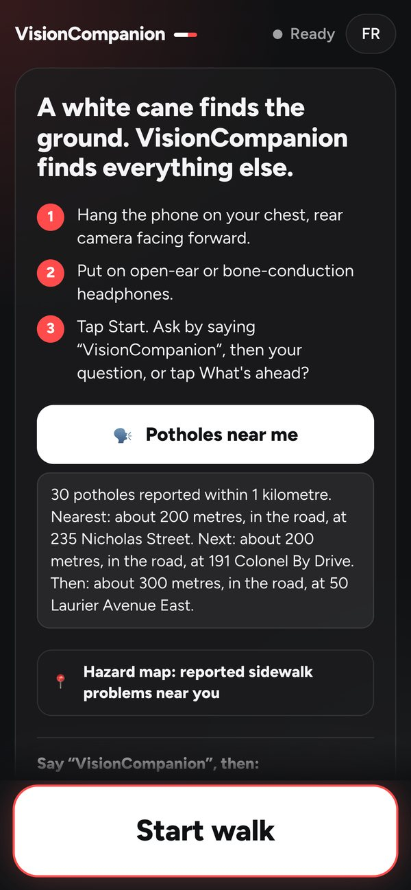
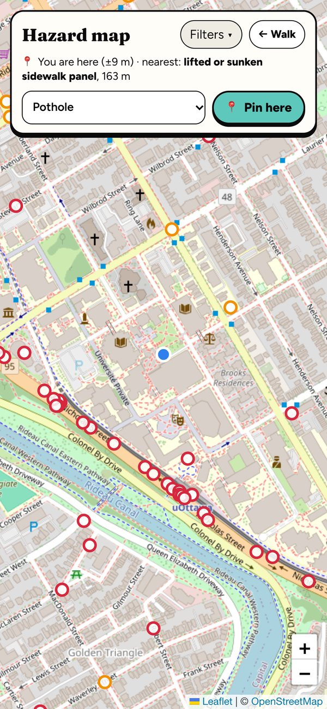
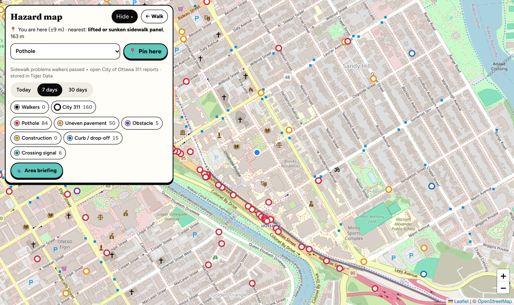

# VisionCompanion
**A white cane finds the ground. VisionCompanion finds everything else.** Potholes, curbs, steps, doors, construction, stop signs and branches at head height are announced calmly, before the cane reaches them, and only when it matters. Anything else, you ask: *"VisionCompanion, what's ahead?"*

VisionCompanion runs on an iPhone worn on a chest strap. It watches the path with the rear camera, uses **Gemini** to understand each snapshot, and speaks in an **ElevenLabs** voice (English or French) through open-ear headphones, so the walker still hears traffic.

> Built by team **Goobers** (Abdul, Aroha, Jibril, Siddig) for Hack the Hill III (uOttawa, Sept 25–27, 2026). Original product spec: [`SEEWALK_SPEC.md`](SEEWALK_SPEC.md) (the project's first name was SeeWalk). Where the two differ, **this README describes the app as built**.

**Live app:** [https://visioncompanion.vercel.app](https://visioncompanion.vercel.app)  
**Repository:** [https://github.com/dkabduli/VisionCompanion](https://github.com/dkabduli/VisionCompanion)

Devpost deadline: **Sunday Sept 27, 2026, 10:00 AM EDT** (team target 9:30 AM). Judges read the commit history, so the work lives in this repo.

<p align="center">
  
  &nbsp;&nbsp;
  
</p>
<p align="center"><sub>Real screenshots of the live app: <b>🗣️ Potholes near me</b> (spoken before you leave the house) and the hazard map a helper sees.</sub></p>

**Why it exists.** A cane is superb at the ground within a metre. It can't tell you the stop sign is 15 metres away,
that the sidewalk ahead is heaved, that a branch hangs at head height, or that the city already knows about a
broken audible crossing signal on your route. VisionCompanion adds exactly those, by ear, and stays quiet otherwise:
no running commentary about every person and parked car. It never says a path is "clear" or "safe", in any language.

---

## What it does

**On its own (street alerts, on by default).** A tone in the left or right ear, then the voice: *"Stop sign on your right"*, *"Pothole ahead"*, *"Steps up ahead"*, *"Door ahead"*, *"Construction ahead"*, *"Obstacle at head height ahead"*, *"Crosswalk ahead"*, *"Traffic light ahead"* (never its colour, never "go").

- Said **at first sighting**: signs up to ~15 m away, trip hazards up to ~10 m.
- Things you can trip on are said **once more when they're under 2 m**, as a last warning.
- Each thing is said **once, whatever its direction** (a curb at a corner doesn't repeat as you turn); again only after 30 s (45 s for signs).
- **People, cars, chairs and benches are not announced** unprompted: in testing they never stopped. The walker asks instead.
- After **10 seconds with nothing to warn about**, it describes the place once: *"Before you, a wide sidewalk with trees."* The same place is not repeated. A different place can be described only after another 30 seconds of quiet. It never says the path is safe or clear.

**When asked** (say **"VisionCompanion"**, then the question; a chime confirms it heard):

| Say | Answer (example) |
|---|---|
| "…what's ahead?" (or tap **What's ahead?**) | "A sidewalk with a stop sign on the right and parked cars" |
| "…what am I holding?" | "A black laptop power adapter" |
| "…what's blocking my path?" | "A chair and a bin ahead" / "Nothing detected in your path" (never "clear") |
| "…read this." | The sign or label, word for word |
| "…where was the elevator?" | From the last 30 s of the walk: "Elevator was on your left" |
| "…where's the nearest pothole?" / "…what's around me?" | From the hazard map: *"Nearest: about 200 metres, in the road, at 235 Nicholas Street…"* (see [Hazard map](#hazard-map-tiger-data-the-map-by-ear)) |
| "…is it safe to cross?" | "I can't tell you when it's safe to cross. Listen for traffic and use your cane." |

**On screen** (for a companion walking alongside, and for low-vision users):

- The phrase in large type with a direction arrow, coloured by urgency, plus the **last two alerts faded** underneath. The panel stays one height, so the camera picture does not jump when the words change.
- A long **"read this"** answer shows four lines and scrolls inside that panel. The last line fades while there is more below.
- The **edge of the camera view glows** on the side the alert came from (red urgent, amber warning, white information).
- While walking, the status is a **white dot that breathes**. It turns **red** only for no connection or a blocked camera. The top bar stays one line, in English and in French.
- A Siri-style pill: **Listening…** (bars follow the walker's voice), **Thinking…**, then the voice's name (**River**) with bars that follow her actual voice.
- **Four ElevenLabs voices** (River, Alice, Charlie, Moyo). One tap chooses a voice and plays a sample. Samples play with the iPhone ringer off.
- **English / Français** in one tap: screen, clips, voice commands and answers all switch. The server makes sure French mode never speaks English.
- **Opens like an app:** Share → Add to Home Screen gives a "Companion" icon that runs full screen.
- The camera locks to the **main rear lens** at 1080p, with continuous focus where the phone allows it, so the picture does not hop to the ultra-wide lens up close.

**Fails out loud.** Silence never means "all clear" by accident:

| Condition | What the walker hears |
|---|---|
| 2 failed checks in a row | low tone + "No connection, I can't see right now" (every 20 s; "Connection back" on recovery) |
| Lens covered, or Gemini can't see a dark frame twice in a row | low tone + "Camera blocked" |
| A dark street Gemini can still read | the hazard, as in daylight. Not "Camera blocked" |
| Three dark snapshots in a row (~2.5 s) | the flashlight comes on, on iPhones where Safari allows it, and stays on until Stop |
| Asked, image too blurry or fully black | "Unclear" |
| Asked, nothing there | "Nothing detected" (never "clear" or "safe", in either language) |
| An answer is taking more than 3 s | a soft double pulse until it arrives |

---

## Hazard map (Tiger Data): the map, by ear

The walker is blind or has low vision, so **they never see this map**. It only matters because it turns into
sound: *what* is reported, *how far*, *which side* of the way they're walking, and *whether the location can be
trusted right now*. The screen map (`?map`) is for sighted helpers, setting up a demo, and judges.
Full design: [docs/prd/location-alerts.md](docs/prd/location-alerts.md).

### What's in it (all in Tiger Data: Tiger Cloud, PostgreSQL + TimescaleDB)

| Source | What | How it gets there |
|---|---|---|
| **Walkers** (filled pins) | Potholes, uneven pavement, obstacles, construction and curbs that Gemini saw with confidence ≥ 0.7, with GPS and time. No photos, no people | Sent during every walk (`POST /hazards`), also from photos taken for a question. Stored in the **`hazard_reports` hypertable** (time-series). The same walk, type and spot within 15 m and 5 min is saved once |
| **Pinned** | A real hazard someone pinned standing beside it (📍 Pin here on the map page) | `POST /hazards` with `source: "pinned"`. Walkers hear it like a sighting. (`test` pins from automated smoke tests are never announced) |
| **City of Ottawa 311** (rings) | ~1,500 reports the city **hasn't fixed yet**: potholes, lifted, sunken or broken sidewalk, broken curbs, branches over the sidewalk, and crossings whose walk signal, **audible signal** or push button is broken | [Ottawa's open 311 file](https://open.ottawa.ca/) (Open Government Licence) → `server/city311.py` → the `city_reports` table. Refreshed daily by Vercel Cron (`CRON_SECRET`), or `scripts/import_311.py` |

Around uOttawa that's about **100 reports within 1 km**, 58 of them potholes (most in the road).

<p align="center">
  
</p>
<p align="center"><sub>The live hazard map around uOttawa (Tiger Data). Rings: open City of Ottawa 311 reports — <b>red</b> potholes (clustered on Nicholas St and Colonel By Dr), <b>orange</b> lifted or sunken sidewalk, <b>blue</b> curbs, <b>green</b> broken crossing signals. The blue dot is the phone. A walker never sees this: they hear it.</sub></p>

### What the walker hears

| When | They hear (EN; French too) |
|---|---|
| **Before leaving the house:** tap **🗣️ Potholes near me** at the top of the start screen (works with VoiceOver, and with the ringer off) | *"3 potholes reported within 1 kilometre. Nearest: about 200 metres, in the road, at 235 Nicholas Street. Next: …"* |
| **Start walk** | a Gemini **area briefing** of real reports within 300 m: *"Watch for a lifted or sunken sidewalk panel at 109 Osgoode Street…"* (Gemini only rewords the list; plain summary if it adds safety talk or the wrong language; never "clear") |
| **Walking toward a reported hazard**, ~40 m, if it's **ahead** | a soft two-note **map chime** (different from the camera's beep: *reported*, not *seen*), then *"Lifted or sunken sidewalk panel reported about 40 metres ahead."* |
| **~15 m from it**, any side | *"Pothole nearby, on your left. Be careful."* — panned to that ear |
| **"VisionCompanion, where's the nearest pothole?"** / *"…any potholes near me?"* | the nearest three potholes within 1 km (road ones too, marked "in the road"), rough metres, street address, and **ahead / on your left / behind you** once they're walking |
| **"VisionCompanion, what's around me?"** | the same for every reported sidewalk problem, each named |
| GPS lost or weak / back | once each: *"Location is weak. Reported hazards paused."* · *"Location back."* · *"Location is off. Reported hazards won't be announced."* |
| The camera sees the same pothole | only the camera's *"Pothole ahead"*: the map doesn't repeat it |

- Map alerts are **low priority**: they never interrupt a camera alert or an answer. They wait for silence and are only
  marked said once spoken, so a busy moment delays them, never loses them.
- **Walk alerts** use sidewalk hazards only (walkers, pins, city sidewalk and crossing reports). Road potholes are
  said only when someone **asks** about potholes: beside a busy road they would otherwise come every few steps.
- The city often files several reports for one spot: one place is said once.

### Where the walker is: honest GPS

- The iPhone's GPS is the best a web app has: **5–15 m** outdoors on a normal street, 20–50 m between tall
  buildings. It reports its own accuracy with every reading. Google Maps or Gemini can't make it more precise.
- **Smoothing:** an accuracy-weighted average of the last ~5 s of readings, so one jumpy reading can't set off an alert.
- **Which way they're walking:** iOS's own heading while moving, otherwise the bearing of their last ≥ 8 m. Standing
  still, answers give distance and address but **no left/right** (a wrong "on your left" is worse than none).
- **Warn early, never late:** the distance used is *"it could be this close"* (distance − GPS accuracy). Readings worse
  than ±50 m are ignored, and the walker is told once.
- **Everything within 1.5 km is loaded once at Start** and checked on the phone, so a weak signal mid-walk doesn't stop
  the alerts (reloaded after 750 m or 5 minutes).
- **Privacy:** the walker's position isn't stored. Only a hazard's own position is saved, when one is seen or pinned.

### The map page (`?map`, for helpers)

- A compact card on a phone: **📍 You are here (±8 m) · nearest: pothole, 38 m**, and **📍 Pin here** with a type
  picker. Filters (time range, sources, types) and the Gemini **Area briefing** fold away behind **Filters**
  (open on a computer, remembered).
- Pins **fade in nearest-first** and never redraw on refresh (no flicker); the "you are here" dot glides with you.

---

## How it works: the data flow

**In plain English:** the phone shows a live camera feed, but nobody presses a shutter. Every **0.8 s** the app grabs **one still snapshot** and sends it to our server, with up to **two at Gemini at once**, so a fresh look arrives about every second even though each answer takes ~1.6–2 s. Gemini returns structured hazards (e.g. *pothole, ahead, near, 0.95 confidence, "Pothole ahead"*). The phone decides whether it's worth saying and plays a **pre-recorded ElevenLabs clip** for it instantly. Nothing is saved to the camera roll. A dark street still goes to Gemini. iOS is left to choose the frame rate, so the exposure can lengthen at night.

```
 PHONE (iPhone Safari, worn on chest)                     SERVER (FastAPI on Vercel)      
┌───────────────────────────────────────┐              ┌────────────────────────────────────────┐
│ 1. CAPTURE                            │              │                                        │
│    rear camera → canvas → 768px JPEG  │  2. POST     │ 3. GEMINI 3.5 Flash-Lite               │
│    every 0.8 s, up to 2 at a time     ├──/analyze───►│    thinking_level = "minimal"          │
│                                       │ {image,lang} │    structured JSON (SceneResult)       │
│                                       │              │    French mode: no English, no "clear" │
│ 5. DECIDE (pickAlert)                 │◄────JSON─────┤ 4. SceneResult {hazards[], summary}    │
│    street hazards only, conf ≥ 0.6    │              │                                        │
│    first sighting + close-up repeat   │              │                                        │
│                 │                     │              │                                        │
│ 6. SPEAK                              │              │ 7. ELEVENLABS                          │
│    tone panned L / C / R, then the    │              │    street alerts: pre-recorded clips   │
│    bundled clip (instant); answers ───┼── /tts ─────►│    answers: Flash v2.5, live, cached   │
│    play the live voice ◄──────────────┼─audio/mpeg───┤                                        │
│                 │                     │              └────────────────────────────────────────┘
│ 8. Bluetooth → open-ear headphones    │
└───────────────────────────────────────┘
```

**Voice questions** use our own mic capture (Safari's built-in speech recognition is blocked on some iPhones): the phone detects speech, clips it (16 kHz WAV) and sends it with the current camera frame to `POST /listen`. **One Gemini call** transcribes it, recognises the command and answers from the image. The server double-checks the wake word and a keyword in Gemini's own transcript before accepting a command, and up to two clips are checked at once so a question isn't lost behind background talk.

### How the pieces talk (Gemini, ElevenLabs, Tiger Data)


Regenerate after changing the flow: `python3 docs/img/make_how_it_works.py`.

### 3D model

[](https://raw.githack.com/dkabduli/VisionCompanion/main/docs/signal-path-3d.html)

**[🦯 Open the 3D model →](https://raw.githack.com/dkabduli/VisionCompanion/main/docs/signal-path-3d.html)** Drag to turn, scroll to zoom. Source: [`docs/signal-path-3d.html`](docs/signal-path-3d.html).


### Measured latency (Sept 26, laptop + iPhone over a Cloudflare tunnel)

| Step | Time |
|---|---|
| Gemini 3.5 Flash-Lite, one snapshot (205 checks from two testers' phones) | **median 2.0 s**, 90% under 2.4 s (1.6 s on our photo set) |
| Voice question → answer text (`/listen`) | median 2.5 s |
| ElevenLabs Flash v2.5, live answer | median 0.36 s |
| Street alert audio (pre-recorded clip) | instant |
| **Hazard in view → heard** | **≈ 2 s** (estimate) |

Alternatives we measured and rejected:

| Option | Result | Why not |
|---|---|---|
| Gemini 3.8 Flash | 3.9–37.7 s per frame | Far too slow (lowest thinking level is "low") |
| Gemini 3.8 Live, speaking for itself | ~1.1 s to first audio | Replaces ElevenLabs; answers ran ~4 s long; harder to control what it says |
| Gemini 3.8 Live → transcript → ElevenLabs | ~1.3–1.5 s | Same speed as Flash-Lite, but needs a WebSocket relay; Live can't return text directly |
| Smaller snapshots (512 / 384 px) | no measurable gain | Kept 768 px |
| Sending the previous frame too | +0.2–0.6 s | Only needed for "approaching" people/cars, which are off |

### Why Gemini multimodal vision fits

1. **Understanding the scene**, not just labelling objects: "steps up to a door", "curb", "branch at head height", "cones on the sidewalk, not the road": things a basic object detector can't name.
2. **Audio + image in one call** for voice questions: transcribe, understand and answer from the photo at once.
3. **Structured output**: answers in our JSON schema, in English or French, so the phone never parses free text.

---

## Decisions we tested (and what we measured)

Every rule in the app came from a measurement, a tester's log, or a failure we caught. The short version:

| Decision | Why (the evidence) |
|---|---|
| **Gemini 3.5 Flash-Lite**, minimal thinking, JSON schema | 3.8 Flash took 3.9–37.7 s per frame; Flash-Lite ~1.6–2 s with structured output we can filter |
| **Two snapshots in flight**, one every 0.8 s | one at a time gave a fresh look only every ~2 s; overlapping halves the wait without a faster model |
| **Street alerts are pre-recorded ElevenLabs clips** (4 voices × EN/FR, every direction) | live speech added ~0.4 s to every alert; clips play instantly. Answers to questions stay live |
| **People, cars and chairs are not announced** | in the first tests they never stopped talking and drowned out the hazards that matter |
| **Once per thing, whatever its direction**, then one close-up warning | a testers' walk logged "Curb ahead" 4× in 20 s and "Construction" 7× in 2 min as the angle changed |
| **Wake word checked in code**, not only by the model | Gemini once heard the app's own "Crosswalk ahead" as "SeeWalk, cross…"; the transcript must contain the name *and* a keyword |
| **Two voice clips checked at once** | 9 questions were dropped in testing while background talk was still being checked |
| **The alert panel never changes height** | the camera box filled what was left, so every alert looked like the video zooming in and out |
| **Main rear lens at 1080p** | iPhones' virtual cameras switched to the ultra-wide lens up close; the default stream was 640×480 |
| **A dark frame still goes to Gemini** | 7 of 8 night photos were falsely "Camera blocked" by the brightness rule; Gemini read them all at ¼ brightness |
| **French answers checked on the server** | ~1 in 30 answers came back in English; the server translates slips and blocks *dégagé*, *libre*, *clear*, *safe* |
| **Map alerts: distance minus GPS error**, sides only once walking | warn early, never late; a wrong "on your left" is worse than none. Tested with simulated walks and on the live site toward a real city report |
| **Road potholes only when asked** | beside a busy road they'd be announced every few steps; at a crossing they matter, so a question includes them |

### By the numbers

| | |
|---|---|
| Automated tests | **186** phone app + **91** server, including the alert rules replayed from real testers' logs |
| Street photos in the Gemini evaluation | **29** (ours at night and in daylight, plus freely licensed Wikimedia Commons) |
| Pre-recorded voice clips | **478** (River: 74 phrases × 2 languages; Alice, Charlie, Moyo: 55 × 2 each) |
| Hazard reports in Tiger Data | ~**1,500** open City of Ottawa 311 reports, plus every confident sighting from walks |
| From a hazard in view to hearing it | **≈ 2 s** (Gemini median 2.0 s on testers' phones; clips play instantly) |
| Languages | English and French, everywhere: screen, clips, voice commands, answers |

---

## Data contracts

### `SceneResult` (Gemini → server → phone)

```jsonc
{
  "hazards": [
    {
      "type": "pothole",          // person | bike | car | crosswalk | stop_sign | traffic_light | pothole | uneven_surface |
                                  // head_height_obstacle | obstacle_in_path | construction | curb_or_dropoff | stairs_down |
                                  // steps_up | door | door_open | door_opening | elevator | pillar | pole | chair | other
      "direction": "ahead",       // left | ahead | right
      "distance": "near",         // close < 2 m · near 2–6 m · far 6–15 m
      "urgency": 2,               // 1 = urgent, 2 = warning, 3 = info
      "confidence": 0.95,         // 0–1; under 0.6 is never spoken
      "approaching": false,
      "phrase": "Pothole ahead"   // ≤ 4 words, in the requested language
    }
  ],
  "unclear": false,               // too blurry or dark to judge
  "summary": "Wide sidewalk with trees on the left"  // spoken only when asked
}
```

### Endpoints

| Method | Path | Request | Response |
|---|---|---|---|
| `POST` | `/analyze` | `{ image, prev_image?, lang: "en" \| "fr", careful? }` | `SceneResult`; `503` if Gemini fails or is slow. `careful` (questions) uses Gemini 3.5 Flash |
| `POST` | `/listen` | `{ audio: <16 kHz WAV base64>, lang, image? }` | `{ heard, intent, answer, command }` |
| `POST` | `/tts` | `{ text, lang, voice: "river" \| "alice" \| "charlie" \| "moyo" }` | `audio/mpeg` |
| `POST` / `GET` | `/hazards`, `/hazards/hotspots` | `{ session_id, lat, lon, type, confidence, source: gemini \| fast_layer \| pinned \| test }` / `?days=` | `{ saved, reason }` / walkers' pins and most-reported spots |
| `GET` | `/hazards/city` | `?south&west&north&east` (≤ 1° across) | open Ottawa 311 reports in that area |
| `GET` | `/hazards/near` | `?lat&lon&radius≤2000&session_id&walkway_only=true` | known hazards nearby, nearest first (city + walkers + pins). A walk loads 1.5 km at Start; "potholes near me" asks 1 km with `walkway_only=false` |
| `POST` | `/hazards/briefing` | `{ lat, lon, lang }` | `{ text, count, by: "gemini" \| "plain" }` |
| `GET` | `/hazards/city/refresh` | `Authorization: Bearer $CRON_SECRET` | re-imports Ottawa 311 (Vercel Cron, daily) |

| `GET` | `/health` | | `{ "ok": true }` |

All `/hazards…` routes answer `503` until `DATABASE_URL` is set. Database errors are logged by kind only, never with the connection string.

**Bundled clips:** every street alert in every direction, plus system messages and the intro, in each voice and language (`web/public/audio/`, keys in [`web/src/audio/clips.json`](web/src/audio/clips.json)). Regenerate with `server/scripts/generate_clips.py`.

---

## Tools

| Tool | What we use it for | Where | Status |
|---|---|---|---|
| **Gemini 3.5 Flash-Lite** (Interactions API) | Hazards from each snapshot, as JSON | `server/gemini.py` | ✅ |
| **Gemini 3.5 Flash** | A more careful look when the walker asks | `server/gemini.py` (`careful`) | ✅ |
| **Gemini (audio + image)** | Voice commands: transcribe, understand, answer in one call | `server/listen.py` | ✅ |
| **ElevenLabs Multilingual v2** | Pre-recorded alerts, 4 voices × EN/FR | `server/scripts/generate_clips.py` | ✅ |
| **ElevenLabs Flash v2.5** | Live answers in the chosen voice | `server/tts.py` | ✅ |
| **FastAPI** (Python 3.12) | Holds the keys; `/analyze`, `/listen`, `/tts` | `server/` | ✅ |
| **React + Vite + TypeScript** | The phone app (PWA, home-screen icon) | `web/` | ✅ |
| **Web Audio API** | Panned tones, clips, live voice, waveform meters | `web/src/audio/` | ✅ |
| **Vercel** | Hosting: the app + the Python server, a permanent HTTPS link, firewall rate limit | `vercel.json`, `api/index.py` | ✅ https://visioncompanion.vercel.app |
| **cloudflared** | HTTPS tunnel to a laptop (the backup) | — | ✅ |
| **Tiger Data** + **Leaflet** | Hazard map: walkers' sightings (hypertable) + open Ottawa 311 reports | `server/hazards.py`, `server/db.py`, `server/city311.py`, `web/src/pages/HazardMap.tsx` (`?map`) | ✅ connected (production needs `DATABASE_URL` in Vercel) |
| **Gemini** (text) | Area briefing from the nearby reports | `server/briefing.py` | ✅ |
| **City of Ottawa open data** | 311 requests the city hasn't fixed: sidewalk, curb, crossing signal, pothole | `server/city311.py` | ✅ daily import |
| **TensorFlow.js COCO-SSD** | On-device people/bikes/cars (~30 ms) | `web/src/detection/` | built, switched off (`PEOPLE_ALERTS`) |
| **Vultr + Caddy** | Alternative hosting | `deploy/` | scripts only; we use Vercel |

---

## Hackathon record

Hack the Hill III. The live phone link is [https://visioncompanion.vercel.app](https://visioncompanion.vercel.app). Camera and microphone on an iPhone only work over HTTPS, which is why the app is hosted rather than opened as a file.

### Resources

| Resource | What we use it for | Where we are |
|---|---|---|
| **Gemini API** (Google AI Studio, Interactions API, structured JSON) | Every snapshot, and every spoken question | **Live.** Walk photos: `gemini-3.5-flash-lite`, thinking `minimal`. Questions: `gemini-3.5-flash`, thinking `low`. Gemini 3.8 Flash was measured at 3.9–37.7 s and is not used |
| **ElevenLabs** Multilingual v2 | Pre-recorded street alerts and system lines, 4 voices × English and French | **Live.** Clips in `web/public/audio/` |
| **ElevenLabs** Flash v2.5 | Live answers (what's ahead, read this, holding, path) | **Live.** `server/tts.py` |
| **FastAPI** (Python) | Holds the keys. `/analyze`, `/listen`, `/tts`, `/health` | **Live** on Vercel via [`api/index.py`](api/index.py), and on a laptop with uvicorn |
| **Vercel** | Permanent HTTPS: the phone app plus the Python server. Firewall: 400 `/api` requests a minute per address | **Live.** [visioncompanion.vercel.app](https://visioncompanion.vercel.app). Redeploy: `vercel deploy --prod` |
| **React, Vite, TypeScript** | The phone app, including Add to Home Screen | **Live.** `web/` |
| **Web Audio API** | Left/right tones, clips, live voice, the listening and speaking bars | **Live.** `web/src/audio/` |
| **iPhone Safari** | The demo phone. Own microphone capture, because Safari's speech recognition returns `service-not-allowed` | **Live** |
| **Cloudflare Tunnel** (`cloudflared`) | HTTPS to a laptop while developing | **Used** as the backup. The public link is Vercel |
| **GitHub** | The repo judges will open | **Live.** [dkabduli/VisionCompanion](https://github.com/dkabduli/VisionCompanion) |
| **Wikimedia Commons** | Freely licensed street photos in [`samples/`](samples/), beside our own | **Used** by `server/scripts/eval_samples.py` |
| **Leaflet** + **OpenStreetMap** | Hazard map at `?map` (link on the start screen) | **Live** |
| **Tiger Data** (PostgreSQL hypertables) | Store reported hazards with time and GPS, and the city's open reports | **Live.** Walks save confident potholes, curbs, construction and obstacles with GPS; `?map` shows them with Ottawa's open 311 reports |
| **City of Ottawa open data** (311, Open Government Licence) | Sidewalk problems the city hasn't fixed yet | **Live.** Imported daily; spoken as "Reported nearby" and in the area briefing |
| **TensorFlow.js COCO-SSD** | On-device people, bikes and cars | **Built, switched off** (`PEOPLE_ALERTS`). Those alerts flooded the walker in testing |
| **Vultr** + **Caddy** | A virtual-machine host we scripted first | **Scripts only** (`deploy/`). The running app is on Vercel |
| **GoDaddy Registry** | A lasting domain name for the live app | **Not set up yet.** Next, before submit |
| **Auth0** | A login for an admin map | **Not used.** No login in this build |
| **Presage, Solana** | — | **Not used.** No fit for a walking aid |

### Checkpoints we have hit

| Checkpoint | What is true now |
|---|---|
| Repo and history | Commits run through the weekend on `main`. First name was SeeWalk; the product name is VisionCompanion |
| Phone over HTTPS | [visioncompanion.vercel.app](https://visioncompanion.vercel.app) opens in Safari. Share → Add to Home Screen runs it full screen |
| Gemini loop | A snapshot every 0.8 s becomes structured hazards, then a spoken clip. About 2 s from hazard in view to heard |
| Alert rules | Street hazards only. First sighting, one close warning for trip hazards, then quiet. Signs, doors, elevators and pillars do not repeat just because the direction changed |
| Voice | "VisionCompanion", then the question. Rising chime, falling chime, answer. Wake word is checked in code, not only by the model |
| English and French | Screen, clips, commands and answers. French mode translates an English slip and never says clear, safe, dégagé or libre |
| Fail out loud | No connection, camera blocked, unclear, nothing detected. A dark street is still sent to Gemini. The flashlight comes on after three dark snapshots, where Safari allows it |
| Questions that must be right | "What's ahead" and "where was…" use a stronger model or the last 30 seconds of memory. "Is it safe to cross?" is always a refusal |
| Quiet places | After 10 seconds with no alert, one description of the place. The same place is not repeated |
| Measured | Latency table above. Sample photos, including Wikimedia Commons, go through `eval_samples.py` |
| Hazard map, by ear | Live on Tiger Data: walks save hazards, pins, ~1,500 open Ottawa 311 reports. The walker hears reported hazards ~40 m ahead and ~15 m away (GPS + direction of travel), can ask "where's the nearest pothole?" by voice or with a button before leaving home, and gets an area briefing at Start. Checked end to end on the live site with a simulated walk toward a real city report |

### Checkpoints still ahead

Sunday Sept 27. Feature freeze is **1:00 AM EDT** (bugs only after that). Submit by **10:00 AM EDT**, team target **9:30 AM**.

| Still to do | Why it matters |
|---|---|
| **Demo video, about 2 minutes** | Script: [docs/demo-script.md](docs/demo-script.md). Shot list: [docs/shot-list.md](docs/shot-list.md). Film outside in daylight if Saturday's light is gone: Sunday 7–8 AM |
| **Devpost** | Four names (Abdul, Aroha, Jibril, Siddig), the video, this GitHub repo, and [https://visioncompanion.vercel.app](https://visioncompanion.vercel.app) |
| **A real walk with GPS** | The location alerts were tested with a simulated GPS walk. On the phone: walk toward 109 Osgoode St (a real city report) or a pinned pothole |
| **GoDaddy domain** | Point a Registry domain at the Vercel app so the link has a real name. Prize target in the original spec: Best Domain Name |
| **Live demo at the table** | Read this, what am I holding, what's blocking my path, what's ahead, and the cross refusal. The video shows the walk; the table shows the questions |

Prize targets from [`SEEWALK_SPEC.md`](SEEWALK_SPEC.md) that this build is aimed at: **Best Use of Gemini API**, **Best Use of ElevenLabs**, **Best UI/UX**. plus **Best Use of Tiger Data** (the hazard map). **Best Domain Name (GoDaddy)** is still open. Vultr was the first hosting plan; Vercel is what is actually serving the phone.

---

## Team

| Person | Role | PRD |
|---|---|---|
| **Aroha** | AI + backend | [aroha-ai-backend.md](docs/prd/aroha-ai-backend.md) |
| **Abdul** | Camera + capture, voice commands | [abdul-camera-capture.md](docs/prd/abdul-camera-capture.md) |
| **Jibril** | Phone UI + audio | [jibril-ui-audio.md](docs/prd/jibril-ui-audio.md) |
| **Siddig** | Tunnel, video, Devpost | [siddig-deploy-video.md](docs/prd/siddig-deploy-video.md) |

Shared contract: [docs/prd/README.md](docs/prd/README.md). Demo video + live demo: [docs/demo-script.md](docs/demo-script.md). Home-screen app: [docs/prd/home-screen-app.md](docs/prd/home-screen-app.md).

---

## Run it

**Hosted:** [https://visioncompanion.vercel.app](https://visioncompanion.vercel.app)

- The phone app is static files. The FastAPI server is one Python function, [`api/index.py`](api/index.py).
- Keys live in the Vercel project's environment variables.
- A firewall rule limits `/api` to 400 requests a minute per address.
- Redeploy from the repo root with `vercel deploy --prod`. **Deploy only from `main`, after `git pull`**: deploying another branch overwrites teammates' fixes on the live link.

**On a laptop** (the backup): the iPhone reaches it through an HTTPS tunnel. Needs **Python 3.10+** and Node 20+.

```bash
cd server && python3 -m venv .venv && .venv/bin/pip install -r requirements.txt
cp .env.example .env          # fill in the keys below, then:
.venv/bin/python scripts/check_connections.py
```

Then, each in its own terminal (the full checklist is in [docs/demo-script.md](docs/demo-script.md)):

```bash
cd server && .venv/bin/uvicorn main:app --host 127.0.0.1 --port 8000
```
```bash
cd web && npm install && npm run build && npx vite preview --port 4173
```
```bash
cloudflared tunnel --protocol http2 --url http://localhost:4173
```

Open the printed `https://….trycloudflare.com` link in Safari on the iPhone (Share → Add to Home Screen for the app icon).

`server/.env` is git-ignored:

| Variable | Value |
|---|---|
| `GEMINI_API_KEY` | from Google AI Studio |
| `GEMINI_MODEL` / `GEMINI_THINKING_LEVEL` | `gemini-3.5-flash-lite` / `minimal` |
| `GEMINI_QUESTION_MODEL` / `GEMINI_QUESTION_THINKING` | `gemini-3.5-flash` / `low` (defaults) |
| `ELEVENLABS_API_KEY` | from ElevenLabs |
| `ELEVENLABS_VOICE_ID` | `SAz9YHcvj6GT2YYXdXww` (River) |
| `ELEVENLABS_TTS_MODEL` | `eleven_flash_v2_5` |
| `DATABASE_URL` | Tiger Data connection string (hazard map). Also set it in Vercel → Settings → Environment Variables, then redeploy. First time only: `.venv/bin/python scripts/init_db.py`, then `.venv/bin/python scripts/import_311.py` for Ottawa's open reports |
| `CRON_SECRET` | optional, Vercel only: any long random string. Turns on the daily Ottawa 311 refresh (Vercel sends it to `/api/hazards/city/refresh`) |
| `ALLOWED_ORIGINS` | optional |

**Tests:** `cd web && npm test` (phone app) · `cd server && .venv/bin/pytest` (server) · `server/.venv/bin/python server/scripts/eval_samples.py [fr]` runs [`samples/`](samples/) (our own street photos plus freely licensed ones from Wikimedia Commons) through Gemini. `server/.venv/bin/python server/scripts/smoke_hazards.py --base https://visioncompanion.vercel.app/api` saves a test pin in Tiger Data, checks the dedupe and confidence rules, reads it back from `/hazards` and `/hazards/hotspots`, checks the Ottawa 311 layer, a "reported nearby" lookup and the area briefing, then deletes its pin (`--base http://localhost:8000` for the laptop server).

## Repo layout

```
├── server/                  # FastAPI: keys, Gemini, ElevenLabs
│   ├── main.py              # /analyze, /tts, /health
│   ├── gemini.py            # the snapshot prompt + call
│   ├── listen.py            # voice commands (/listen)
│   ├── lang_guard.py        # French mode never speaks English; never "clear" / "safe"
│   ├── tts.py, voices.py    # ElevenLabs live voice, 4 voices
│   ├── hazards.py, db.py    # hazard map (Tiger Data)
│   ├── city311.py           # Ottawa open 311 reports → known hazards
│   ├── briefing.py          # area briefing (Gemini, from the reports)
│   └── scripts/             # check_connections, init_db, import_311, smoke_hazards, generate_clips, eval_samples, …
├── web/                     # React + Vite + TS phone app
│   ├── public/              # bundled voice clips, icons, manifest
│   └── src/
│       ├── camera/          # camera, snapshot loop, voice capture
│       ├── alerts/          # what to say and when (pickAlert), memory, idle
│       ├── audio/           # AudioEngine, voices, live waveform
│       ├── pages/           # WalkMode (the app), HazardMap (?map), CameraLab (?lab)
│       ├── map/             # hazard reporter, "reported nearby" alerts, hazard map API
│       └── i18n/            # EN / FR
├── samples/                 # street photos for testing Gemini
└── docs/                    # diagram, 3D model, demo script, PRDs
```

## Design principles

1. **Speak less.** Four words; a tone for direction; say it once.
2. **Hazards first.** Danger → direction → description.
3. **Never guess.** Low confidence means silence, or "Unclear" when asked.
4. **Inform, never command.** Never "safe to cross", "clear" or "go", in any language.
5. **No screen needed.** Everything is spoken; the screen is for companions and low vision, and works with VoiceOver.
6. **Fail out loud.**
7. **Privacy.** Snapshots are analysed and discarded; people are never identified.
