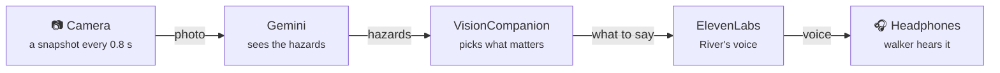

# VisionCompanion

**A white cane finds the ground. VisionCompanion finds everything else.** Potholes, curbs, steps, doors, construction, stop signs and branches at head height are announced calmly, before the cane reaches them, and only when it matters. Anything else, you ask: *"VisionCompanion, what's ahead?"*

VisionCompanion runs on an iPhone worn on a chest strap. It watches the path with the rear camera, uses **Gemini** to understand each snapshot, and speaks in an **ElevenLabs** voice (English or French) through open-ear headphones, so the walker still hears traffic.

> Built by team **Goobers** (Abdul, Aroha, Jibril, Siddig) for Hack the Hill III (uOttawa, Sept 25–27, 2026). Original product spec: [`SEEWALK_SPEC.md`](SEEWALK_SPEC.md) (the project's first name was SeeWalk). Where the two differ, **this README describes the app as built**.

---

## At a glance



### How the pieces talk (Gemini, ElevenLabs, Tiger Data)


Regenerate after changing the flow: `python3 docs/img/make_how_it_works.py`.

### 3D model

[](https://raw.githack.com/dkabduli/VisionCompanion/main/docs/signal-path-3d.html)

**[🦯 Open the 3D model →](https://raw.githack.com/dkabduli/VisionCompanion/main/docs/signal-path-3d.html)** Drag to turn, scroll to zoom. Source: [`docs/signal-path-3d.html`](docs/signal-path-3d.html).

---

## What it does

**On its own (street alerts, on by default).** A tone in the left or right ear, then the voice: *"Stop sign on your right"*, *"Pothole ahead"*, *"Steps up ahead"*, *"Door ahead"*, *"Construction ahead"*, *"Obstacle at head height ahead"*, *"Crosswalk ahead"*, *"Traffic light ahead"* (never its colour, never "go").
- Said **at first sighting**: signs up to ~15 m away, trip hazards up to ~10 m.
- Things you can trip on are said **once more when they're under 2 m**, as a last warning.
- Each thing is said **once, whatever its direction** (a curb at a corner doesn't repeat as you turn); again only after 30 s (45 s for signs).
- **People, cars, chairs and benches are not announced** unprompted: in testing they never stopped. The walker asks instead.

**When asked** (say **"VisionCompanion"**, then the question; a chime confirms it heard):

| Say | Answer (example) |
|---|---|
| "…what's ahead?" (or tap **What's ahead?**) | "A sidewalk with a stop sign on the right and parked cars" |
| "…what am I holding?" | "A black laptop power adapter" |
| "…what's blocking my path?" | "A chair and a bin ahead" / "Nothing detected in your path" (never "clear") |
| "…read this." | The sign or label, word for word |
| "…where was the elevator?" | From the last 30 s of the walk: "Elevator was on your left" |
| "…is it safe to cross?" | "I can't tell you when it's safe to cross. Listen for traffic and use your cane." |

**On screen** (for a companion walking alongside, and for low-vision users):
- The phrase in large type with a direction arrow, coloured by urgency, plus the **last two alerts faded** underneath.
- The **edge of the camera view glows** on the side the alert came from (red urgent, amber warning, white information).
- A Siri-style pill: **Listening…** (bars follow the walker's voice), **Thinking…**, then the voice's name (**River**) with bars that follow her actual voice.
- **Four ElevenLabs voices** (River, Alice, Charlie, Moyo); ▶ to hear each one before choosing.
- **English / Français** in one tap: screen, clips, voice commands and answers all switch. The server makes sure French mode never speaks English.
- **Opens like an app:** Share → Add to Home Screen gives a "Companion" icon that runs full screen.

**Fails out loud.** Silence never means "all clear" by accident:

| Condition | What the walker hears |
|---|---|
| 2 failed checks in a row | low tone + "No connection, I can't see right now" (every 20 s; "Connection back" on recovery) |
| Lens covered / camera stops | low tone + "Camera blocked" |
| Asked, image too blurry or dark | "Unclear" |
| Asked, nothing there | "Nothing detected" (never "clear" or "safe", in either language) |
| An answer is taking more than 3 s | a soft double pulse until it arrives |

---

## How it works: the data flow

**In plain English:** the phone shows a live camera feed, but nobody presses a shutter. Every **0.8 s** the app grabs **one still snapshot** and sends it to our server, with up to **two at Gemini at once**, so a fresh look arrives about every second even though each answer takes ~1.6–2 s. Gemini returns structured hazards (e.g. *pothole, ahead, near, 0.95 confidence, "Pothole ahead"*). The phone decides whether it's worth saying and plays a **pre-recorded ElevenLabs clip** for it instantly. Nothing is saved to the camera roll.

```
 PHONE (iPhone Safari, worn on chest)                     SERVER (FastAPI, on the laptop)
┌───────────────────────────────────────┐              ┌────────────────────────────────────────┐
│ 1. CAPTURE                            │              │                                        │
│    rear camera → canvas → 768px JPEG  │  2. POST     │ 3. GEMINI 3.5 Flash-Lite               │
│    every 0.8 s, up to 2 at a time     ├──/analyze───►│    thinking_level = "minimal"          │
│                                       │ {image,lang} │    structured JSON (SceneResult)       │
│                                       │              │    French mode: no English, no "clear" │
│ 5. DECIDE (pickAlert)                 │◄────JSON─────┤ 4. SceneResult {hazards[], summary}    │
│    street hazards only, conf ≥ 0.6    │              │                                        │
│    first sighting + close-up repeat   │              │                                        │
│                 │                     │              │                                        │
│ 6. SPEAK                              │              │ 7. ELEVENLABS                          │
│    tone panned L / C / R, then the    │              │    street alerts: pre-recorded clips   │
│    bundled clip (instant); answers ───┼── /tts ─────►│    answers: Flash v2.5, live, cached   │
│    play the live voice ◄──────────────┼─audio/mpeg───┤                                        │
│                 │                     │              └────────────────────────────────────────┘
│ 8. Bluetooth → open-ear headphones    │
└───────────────────────────────────────┘
```

**Voice questions** use our own mic capture (Safari's built-in speech recognition is blocked on some iPhones): the phone detects speech, clips it (16 kHz WAV) and sends it with the current camera frame to `POST /listen`. **One Gemini call** transcribes it, recognises the command and answers from the image. The server double-checks the wake word and a keyword in Gemini's own transcript before accepting a command, and up to two clips are checked at once so a question isn't lost behind background talk.

### Measured latency (Sept 26, laptop + iPhone over a Cloudflare tunnel)

| Step | Time |
|---|---|
| Gemini 3.5 Flash-Lite, one snapshot (205 checks from two testers' phones) | **median 2.0 s**, 90% under 2.4 s (1.6 s on our photo set) |
| Voice question → answer text (`/listen`) | median 2.5 s |
| ElevenLabs Flash v2.5, live answer | median 0.36 s |
| Street alert audio (pre-recorded clip) | instant |
| **Hazard in view → heard** | **≈ 2 s** (estimate) |

Alternatives we measured and rejected:

| Option | Result | Why not |
|---|---|---|
| Gemini 3.8 Flash | 3.9–37.7 s per frame | Far too slow (lowest thinking level is "low") |
| Gemini 3.8 Live, speaking for itself | ~1.1 s to first audio | Replaces ElevenLabs; answers ran ~4 s long; harder to control what it says |
| Gemini 3.8 Live → transcript → ElevenLabs | ~1.3–1.5 s | Same speed as Flash-Lite, but needs a WebSocket relay; Live can't return text directly |
| Smaller snapshots (512 / 384 px) | no measurable gain | Kept 768 px |
| Sending the previous frame too | +0.2–0.6 s | Only needed for "approaching" people/cars, which are off |

### Why Gemini multimodal vision fits

1. **Understanding the scene**, not just labelling objects: "steps up to a door", "curb", "branch at head height", "cones on the sidewalk, not the road": things a basic object detector can't name.
2. **Audio + image in one call** for voice questions: transcribe, understand and answer from the photo at once.
3. **Structured output**: answers in our JSON schema, in English or French, so the phone never parses free text.

---

## Data contracts

### `SceneResult` (Gemini → server → phone)

```jsonc
{
  "hazards": [
    {
      "type": "pothole",          // person | bike | car | crosswalk | stop_sign | traffic_light | pothole | uneven_surface |
                                  // head_height_obstacle | obstacle_in_path | construction | curb_or_dropoff | stairs_down |
                                  // steps_up | door | door_open | door_opening | elevator | pillar | pole | chair | other
      "direction": "ahead",       // left | ahead | right
      "distance": "near",         // close < 2 m · near 2–6 m · far 6–15 m
      "urgency": 2,               // 1 = urgent, 2 = warning, 3 = info
      "confidence": 0.95,         // 0–1; under 0.6 is never spoken
      "approaching": false,
      "phrase": "Pothole ahead"   // ≤ 4 words, in the requested language
    }
  ],
  "unclear": false,               // too blurry or dark to judge
  "summary": "Wide sidewalk with trees on the left"  // spoken only when asked
}
```

### Endpoints

| Method | Path | Request | Response |
|---|---|---|---|
| `POST` | `/analyze` | `{ image, prev_image?, lang: "en" \| "fr", careful? }` | `SceneResult`; `503` if Gemini fails or is slow. `careful` (questions) uses Gemini 3.5 Flash |
| `POST` | `/listen` | `{ audio: <16 kHz WAV base64>, lang, image? }` | `{ heard, intent, answer, command }` |
| `POST` | `/tts` | `{ text, lang, voice: "river" \| "alice" \| "charlie" \| "moyo" }` | `audio/mpeg` |
| `POST` / `GET` | `/hazards`, `/hazards/hotspots` | hazard + GPS / — | hazard map (needs `DATABASE_URL`) |
| `GET` | `/health` | | `{ "ok": true }` |

**Bundled clips:** every street alert in every direction, plus system messages and the intro, in each voice and language (`web/public/audio/`, keys in [`web/src/audio/clips.json`](web/src/audio/clips.json)). Regenerate with `server/scripts/generate_clips.py`.

---

## Tools

| Tool | What we use it for | Where | Status |
|---|---|---|---|
| **Gemini 3.5 Flash-Lite** (Interactions API) | Hazards from each snapshot, as JSON | `server/gemini.py` | ✅ |
| **Gemini 3.5 Flash** | A more careful look when the walker asks | `server/gemini.py` (`careful`) | ✅ |
| **Gemini (audio + image)** | Voice commands: transcribe, understand, answer in one call | `server/listen.py` | ✅ |
| **ElevenLabs Multilingual v2** | Pre-recorded alerts, 4 voices × EN/FR | `server/scripts/generate_clips.py` | ✅ |
| **ElevenLabs Flash v2.5** | Live answers in the chosen voice | `server/tts.py` | ✅ |
| **FastAPI** (Python 3.12) | Holds the keys; `/analyze`, `/listen`, `/tts` | `server/` | ✅ |
| **React + Vite + TypeScript** | The phone app (PWA, home-screen icon) | `web/` | ✅ |
| **Web Audio API** | Panned tones, clips, live voice, waveform meters | `web/src/audio/` | ✅ |
| **cloudflared** | HTTPS tunnel so the iPhone can use the camera and mic | — | ✅ |
| **Tiger Data** + **Leaflet** | Hazard map: reported hazards with GPS over time | `server/hazards.py`, `server/db.py`, `web/src/pages/HazardMap.tsx` (`?map`) | code built, **not connected** (no `DATABASE_URL`) |
| **TensorFlow.js COCO-SSD** | On-device people/bikes/cars (~30 ms) | `web/src/detection/` | built, switched off (`PEOPLE_ALERTS`) |
| **Vultr + Caddy** | Hosting | `deploy/` | scripts only; the demo runs from the laptop |

---

## Team

| Person | Role | PRD |
|---|---|---|
| **Aroha** | AI + backend | [aroha-ai-backend.md](docs/prd/aroha-ai-backend.md) |
| **Abdul** | Camera + capture, voice commands | [abdul-camera-capture.md](docs/prd/abdul-camera-capture.md) |
| **Jibril** | Phone UI + audio | [jibril-ui-audio.md](docs/prd/jibril-ui-audio.md) |
| **Siddig** | Tunnel, video, Devpost | [siddig-deploy-video.md](docs/prd/siddig-deploy-video.md) |

Shared contract: [docs/prd/README.md](docs/prd/README.md). Demo video + live demo: [docs/demo-script.md](docs/demo-script.md). Home-screen app: [docs/prd/home-screen-app.md](docs/prd/home-screen-app.md).

---

## Run it

The demo runs from a laptop; the iPhone reaches it through an HTTPS tunnel. Needs **Python 3.10+** and Node 20+.

```bash
cd server && python3 -m venv .venv && .venv/bin/pip install -r requirements.txt
cp .env.example .env          # fill in the keys below, then:
.venv/bin/python scripts/check_connections.py
```

Then, each in its own terminal (the full checklist is in [docs/demo-script.md](docs/demo-script.md)):

```bash
cd server && .venv/bin/uvicorn main:app --host 127.0.0.1 --port 8000
```
```bash
cd web && npm install && npm run build && npx vite preview --port 4173
```
```bash
cloudflared tunnel --protocol http2 --url http://localhost:4173
```

Open the printed `https://….trycloudflare.com` link in Safari on the iPhone (Share → Add to Home Screen for the app icon).

`server/.env` is git-ignored:

| Variable | Value |
|---|---|
| `GEMINI_API_KEY` | from Google AI Studio |
| `GEMINI_MODEL` / `GEMINI_THINKING_LEVEL` | `gemini-3.5-flash-lite` / `minimal` |
| `GEMINI_QUESTION_MODEL` / `GEMINI_QUESTION_THINKING` | `gemini-3.5-flash` / `low` (defaults) |
| `ELEVENLABS_API_KEY` | from ElevenLabs |
| `ELEVENLABS_VOICE_ID` | `SAz9YHcvj6GT2YYXdXww` (River) |
| `ELEVENLABS_TTS_MODEL` | `eleven_flash_v2_5` |
| `DATABASE_URL` | Tiger Data connection string (hazard map) |
| `ALLOWED_ORIGINS` | optional |

**Tests:** `cd web && npm test` (phone app) · `cd server && .venv/bin/pytest` (server) · `server/.venv/bin/python server/scripts/eval_samples.py [fr]` runs [`samples/`](samples/) (our own street photos plus freely licensed ones from Wikimedia Commons) through Gemini.

## Repo layout

```
├── server/                  # FastAPI: keys, Gemini, ElevenLabs
│   ├── main.py              # /analyze, /tts, /health
│   ├── gemini.py            # the snapshot prompt + call
│   ├── listen.py            # voice commands (/listen)
│   ├── lang_guard.py        # French mode never speaks English; never "clear" / "safe"
│   ├── tts.py, voices.py    # ElevenLabs live voice, 4 voices
│   ├── hazards.py, db.py    # hazard map (Tiger Data)
│   └── scripts/             # check_connections, generate_clips, eval_samples, …
├── web/                     # React + Vite + TS phone app
│   ├── public/              # bundled voice clips, icons, manifest
│   └── src/
│       ├── camera/          # camera, snapshot loop, voice capture
│       ├── alerts/          # what to say and when (pickAlert), memory, idle
│       ├── audio/           # AudioEngine, voices, live waveform
│       ├── pages/           # WalkMode (the app), HazardMap (?map), CameraLab (?lab)
│       └── i18n/            # EN / FR
├── samples/                 # street photos for testing Gemini
└── docs/                    # diagram, 3D model, demo script, PRDs
```

## Design principles

1. **Speak less.** Four words; a tone for direction; say it once.
2. **Hazards first.** Danger → direction → description.
3. **Never guess.** Low confidence means silence, or "Unclear" when asked.
4. **Inform, never command.** Never "safe to cross", "clear" or "go", in any language.
5. **No screen needed.** Everything is spoken; the screen is for companions and low vision, and works with VoiceOver.
6. **Fail out loud.**
7. **Privacy.** Snapshots are analysed and discarded; people are never identified.
