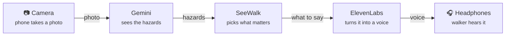

# SeeWalk

**A white cane finds the ground. SeeWalk finds everything else.** People, bikes, cars, potholes and branches at head height are announced calmly, and only when it matters.

SeeWalk runs on a phone worn on a lanyard or chest strap. It watches the path ahead with the rear camera, uses **Gemini** to understand the scene, and speaks short, prioritized alerts in an **ElevenLabs** voice (English or French) through open-ear Bluetooth headphones.

> Built by team **Goobers** for Hack the Hill III (uOttawa, Sept 25–27, 2026). Full product spec: [`SEEWALK_SPEC.md`](SEEWALK_SPEC.md).

---

## At a glance



### 3D model

[](https://raw.githack.com/dkabduli/SeeWalk/main/docs/signal-path-3d.html)

**[🦯 Open the 3D model →](https://raw.githack.com/dkabduli/SeeWalk/main/docs/signal-path-3d.html)**

Drag to turn, scroll to zoom. Source: [`docs/signal-path-3d.html`](docs/signal-path-3d.html).

---

## How it works: the data flow

```
 PHONE (iPhone Safari, worn on chest)                         SERVER (FastAPI on Vultr)
┌──────────────────────────────────────────┐                ┌──────────────────────────────────────┐
│ 1. CAPTURE                               │                │                                      │
│    rear camera → canvas → 768px JPEG q0.7│                │                                      │
│    → base64   (every ~2.5 s, 1 in flight)│                │                                      │
│                    │                     │  2. POST       │                                      │
│                    └─────────────────────┼──/analyze─────►│ 3. GEMINI 3.8 Flash                  │
│                                          │ {image, lang}  │    client.interactions.create(       │
│                                          │                │      input=[prompt, image],          │
│                                          │                │      response_format=SceneResult)    │
│                                          │                │    → Pydantic validation             │
│                    ┌─────────────────────┼◄─────JSON──────┤ 4. SceneResult {hazards[], unclear}  │
│                    ▼                     │                │                                      │
│ 5. ALERT MANAGER                         │                │                                      │
│    confidence ≥ 0.6                      │                │                                      │
│    → 2-frame confirm (urgent skips)      │                │                                      │
│    → cooldown 6 s per type+direction     │                │                                      │
│    → priority queue (tier 1 interrupts)  │                │                                      │
│                    │                     │                │                                      │
│                    ▼                     │                │                                      │
│ 6. AUDIO ENGINE (Web Audio)              │                │                                      │
│    a) tone, panned L / center / R        │                │                                      │
│    b) known hazard → preloaded           │                │                                      │
│       ElevenLabs clip (no network)       │                │                                      │
│    c) "other" hazard ────────────────────┼──POST /tts────►│ ElevenLabs Flash TTS (LRU cached)    │
│       play returned mp3 ◄────────────────┼────audio/mpeg──┤                                      │
│                    │                     │                │                                      │
│                    ▼                     │                └──────────────────────────────────────┘
│ 7. Bluetooth → open-ear headphones       │
└──────────────────────────────────────────┘
```

### Step by step

1. **Capture.** The phone's rear camera streams into a hidden `<video>`. About every 2.5 s, a frame is drawn to a canvas, resized to 768 px on the long edge, JPEG-encoded at quality 0.7 and base64-encoded. Only **one request is in flight** at a time. The next capture is scheduled after the previous response arrives, with a 5 s timeout.
2. **Send.** The phone sends `POST /analyze` with `{ image, lang }`. API keys never leave the server.
3. **Understand (Gemini).** The backend calls **Gemini 3.8 Flash** through the **Interactions API** with a system prompt (below) and the image, requesting **structured JSON** that matches the `SceneResult` schema. Each call is **stateless**: no `previous_interaction_id`, so every frame is judged on its own. On timeout or error, the backend retries once with `gemini-3.5-flash-lite`, then returns `503`.
4. **Return.** The validated `SceneResult` goes back to the phone.
5. **Decide (alert manager).** This runs on the client and is the core of the UX:
   - drop any hazard with `confidence < 0.6` ("never guess")
   - a non-urgent hazard must appear in **2 consecutive frames** (same type + direction); `urgency: 1` speaks on the first frame
   - **cooldown**: the same type + direction is not repeated within 6 s
   - **priority tiers**: tier 1 interrupts anything; tier 2 is a short warning; tier 3 plays only when nothing else is playing
6. **Speak (audio engine).**
   - **Tone first.** A short Web Audio tone is panned left, center or right with `StereoPannerNode`, so direction comes through before any words.
   - **Then words:**
     - Known hazard types play a **pre-generated ElevenLabs clip**, preloaded as an `AudioBuffer`. It plays instantly and needs no network.
     - Rare `other` hazards send their `short_label` (≤ 5 words, already in the user's language) to `POST /tts`. The server calls **ElevenLabs Flash** and caches the result by `(text, lang)`.
7. **Hear.** Audio goes over Bluetooth to open-ear or bone-conduction headphones (e.g. Shokz), so the user can still hear traffic.

### Gemini system prompt (starting point, tune in AI Studio)

> You assist a blind pedestrian walking on a quiet street. The camera is chest-height, facing forward. Report ONLY things relevant to walking safely in the next ~10 metres: drop-offs, stairs, curbs, potholes, uneven pavement, obstacles in the walking path, head-height obstacles (branches, signs, mirrors), crosswalks, stop signs, construction. Ignore anything off the walking path, parked cars not in the path, buildings, sky. Do not report people or vehicles (handled elsewhere) unless they are an obstacle not moving. Never guess: if not clearly visible, omit it. If the image is too blurry or dark, set unclear=true. Never describe anything as safe to cross. Write short_label in {English|French}.

### Gemini call (Python, `server/gemini.py`)

```python
from google import genai
client = genai.Client()  # reads GEMINI_API_KEY

interaction = client.interactions.create(
    model="gemini-3.8-flash",
    input=[
        {"type": "text", "text": SYSTEM_PROMPT},
        {"type": "image", "data": image_b64, "mime_type": "image/jpeg"},
    ],
    response_format={
        "type": "text",
        "mime_type": "application/json",
        "schema": SceneResult.model_json_schema(),
    },
)
result = SceneResult.model_validate_json(interaction.output_text)
```

---

## Data contracts

### `SceneResult` (Gemini → server → phone)

```jsonc
{
  "hazards": [
    {
      "type": "crosswalk | stop_sign | pothole | uneven_surface | head_height_obstacle | obstacle_in_path | construction | curb_or_dropoff | stairs_down | other",
      "direction": "left | ahead | right",
      "distance": "close | near | far",
      "urgency": 1,            // 1 = urgent, 2, 3
      "confidence": 0.82,      // 0–1
      "short_label": "Fallen branch"  // ≤ 5 words, used only for "other"
    }
  ],
  "unclear": false             // image too blurry/dark to judge
}
```

### Endpoints

| Method | Path | Request | Response |
|---|---|---|---|
| `POST` | `/analyze` | `{ "image": "<base64 jpeg>", "lang": "en" \| "fr" }` | `SceneResult` (JSON); `503` if Gemini is unavailable |
| `POST` | `/tts` | `{ "text": "Fallen branch", "lang": "en" \| "fr" }` | `audio/mpeg` bytes |
| `GET` | `/health` | — | `{ "ok": true }` |

---

## Hazard → audio mapping

Direction goes into the **tone's stereo pan**. The clip wording stays short.

| Gemini `type` | Tier | Tone | Clip key | English | Français |
|---|---|---|---|---|---|
| `stairs_down` | 1 | urgent double beep | `stairs_down` | Stairs going down | Escalier qui descend |
| `curb_or_dropoff` | 1 | urgent double beep | `curb` | Curb ahead | Bordure devant |
| `head_height_obstacle` (close) | 1 | urgent double beep | `head_height` | Obstacle at head height | Obstacle à hauteur de tête |
| `head_height_obstacle` (near/far) | 2 | soft pulse | `head_height` | Obstacle at head height | Obstacle à hauteur de tête |
| `obstacle_in_path` / `construction` | 2 | soft pulse | `obstacle_path` | Obstacle in your path | Obstacle sur votre chemin |
| `pothole` | 2 | soft pulse | `pothole` | Pothole ahead | Nid-de-poule devant |
| `uneven_surface` | 2 | soft pulse | `uneven` | Uneven ground ahead | Sol inégal devant |
| `crosswalk` | 3 | gentle chime | `crosswalk` | Crosswalk ahead | Passage pour piétons devant |
| `stop_sign` | 3 | gentle chime | `stop_sign` | Stop sign ahead | Panneau d'arrêt devant |
| `other` | 2 | soft pulse | *live TTS* | `short_label` | `short_label` |

System clips: `walk_started` / `walk_stopped`, `no_connection`, `camera_blocked`, `unclear`, plus the person/bike/car clips used by the fast layer.

---

## Two speeds

Gemini is the **slow layer** (about 1–2 s per frame). It handles things a basic object detector can't: crosswalks, potholes, head-height branches and construction. A cyclist covers about 10 m in 2 s, so moving hazards (people, bikes, cars) will be caught by an **on-device fast layer** (TensorFlow.js + COCO-SSD, coming next). Both layers feed the **same alert manager and audio engine**, so priorities and cooldowns stay consistent.

## Fail out loud

Silence must never mean "all clear" by accident.

| Condition | What the user hears |
|---|---|
| 2 consecutive `/analyze` failures | low tone + "No connection, I can't see right now" (repeated every 20 s while down; short tone on recovery) |
| Camera track ends / lens covered (very dark frame) | low tone + "Camera blocked" |
| `unclear: true` during a walk | nothing (no noise) |
| `unclear: true` after the user taps **"What's ahead?"** | "Unclear" |

## ElevenLabs usage

- **One multilingual voice** for English and French, so the voice stays the same when the user switches language.
- **Pre-generated clips:** `server/scripts/generate_clips.py` uses `eleven_multilingual_v2` to render every phrase to `web/public/audio/{en,fr}/{key}.mp3`. Run it with `--list-voices` to pick a voice.
- **Live TTS:** `eleven_flash_v2_5` (low latency), only for rare `other` hazards, with a server-side cache.

## iPhone notes

- Tapping **Start walk** creates and resumes the `AudioContext`. iOS requires a user gesture to unlock audio.
- Clips play through Web Audio, not `<audio>` tags, so they aren't blocked by gesture rules mid-walk.
- `<video playsinline muted>` with `facingMode: "environment"`; the Screen Wake Lock keeps the phone awake.
- Camera access requires **HTTPS**. For local testing, run a `cloudflared` or `ngrok` tunnel in front of the Vite dev server (which proxies `/api` to FastAPI).

---

## Repo layout (planned)

```
seewalk/
├── server/                     # FastAPI
│   ├── main.py                 # /analyze, /tts, /health
│   ├── gemini.py               # Interactions API call + prompt
│   ├── tts.py                  # ElevenLabs live TTS + cache
│   ├── schemas.py              # SceneResult, Hazard, request models
│   ├── config.py               # env vars
│   └── scripts/
│       ├── phrases.py          # EN/FR phrase table
│       ├── generate_clips.py   # build web/public/audio/{en,fr}
│       ├── check_connections.py # ping Gemini, ElevenLabs, Tiger Data
│       └── eval_samples.py     # run samples/*.jpg through Gemini, print hazards + latency
├── web/                        # React + Vite + TS PWA
│   ├── public/audio/{en,fr}/   # pre-generated ElevenLabs clips
│   └── src/
│       ├── camera/             # useCamera, captureFrame
│       ├── api/                # analyze(), tts()
│       ├── walk/               # useWalkLoop (cadence, timeouts, failures)
│       ├── alerts/             # AlertManager, hazardTable
│       ├── audio/              # AudioEngine (tones, pan, clips, live TTS)
│       ├── i18n/               # EN/FR strings
│       └── pages/WalkMode.tsx
├── samples/                    # street photos for offline testing
├── docs/signal-path-3d.html    # interactive 3D model of the flow
└── SEEWALK_SPEC.md
```

## Setup (server)

Needs **Python 3.10+** (the Gemini Interactions API isn't in SDK versions that support 3.9).

```bash
cd server
python3 -m venv .venv
.venv/bin/pip install -r requirements.txt
cp .env.example .env          # then fill in the keys (ask Abdul)
.venv/bin/python scripts/check_connections.py
```

`server/.env` is git-ignored. Variables:

| Variable | Value |
|---|---|
| `GEMINI_API_KEY` | from Google AI Studio |
| `GEMINI_MODEL` | `gemini-3.8-flash` |
| `GEMINI_FALLBACK_MODEL` | `gemini-3.5-flash-lite` |
| `ELEVENLABS_API_KEY` | from ElevenLabs → Developers → API keys |
| `ELEVENLABS_VOICE_ID` | `SAz9YHcvj6GT2YYXdXww` (River: one voice for EN + FR) |
| `DATABASE_URL` | Tiger Data connection string (hazard map, later) |
| `ALLOWED_ORIGINS` | e.g. `http://localhost:5173` |

## Build order

- [ ] Server `/health` (config + requirements done)
- [ ] `gemini.py` + `eval_samples.py` on 10+ street photos → **go/no-go** on latency and accuracy; tune the prompt
- [x] API keys + `check_connections.py` (Gemini ✅, ElevenLabs ✅)
- [x] `generate_clips.py` → EN/FR clip library committed (River voice, 48 clips)
- [ ] `/tts` with cache
- [ ] Web scaffold: camera → capture → `/analyze` loop
- [ ] AlertManager (+ unit tests) + AudioEngine → audible end to end
- [ ] Fail-out-loud states, "What's ahead?", captions, EN/FR toggle
- [ ] iPhone test over HTTPS with Bluetooth headphones; tune thresholds and tones

## Design principles

1. **Speak less.** Short phrases; tones for common alerts.
2. **Hazards first.** Danger → direction → description.
3. **Never guess.** Low confidence means silence, or "Unclear" when asked.
4. **Inform, never command.** Never say "safe to cross" or "go."
5. **No screen needed.** Large labelled buttons; works with VoiceOver.
6. **Fail out loud.**
7. **Privacy.** Frames are processed and discarded; people are never identified.
