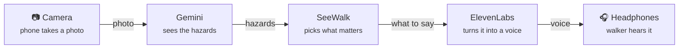

# SeeWalk

**A white cane finds the ground. SeeWalk finds everything else.** People, bikes, cars, potholes and branches at head height are announced calmly, and only when it matters.

SeeWalk runs on a phone worn on a lanyard or chest strap. It watches the path ahead with the rear camera, uses **Gemini** to understand the scene, and speaks short alerts in an **ElevenLabs** voice (English or French) through open-ear Bluetooth headphones.

> Built by team **Goobers** for Hack the Hill III (uOttawa, Sept 25–27, 2026). Original product spec: [`SEEWALK_SPEC.md`](SEEWALK_SPEC.md). Where the two differ, **this README is the current plan**.

---

## At a glance



### 3D model

[](https://raw.githack.com/dkabduli/SeeWalk/main/docs/signal-path-3d.html)

**[🦯 Open the 3D model →](https://raw.githack.com/dkabduli/SeeWalk/main/docs/signal-path-3d.html)**

Drag to turn, scroll to zoom. Source: [`docs/signal-path-3d.html`](docs/signal-path-3d.html).

---

## What we're building for the demo

**Goal: it works and it looks great in a ~2-minute video.** Everything below serves that.

- **In:** live camera → Gemini → short spoken alerts in River's voice, left/right tones, EN/FR, "What's ahead?" button, on-screen captions, fails out loud.
- **Stretch (only if the core is solid):** on-device COCO-SSD fast layer, "Ask" voice questions, Tiger Data hazard map, Vultr deploy.
- **Out:** crowds, night/rain, turn-by-turn navigation, face recognition (never).

---

## How it works: the data flow

```
 PHONE (iPhone Safari, worn on chest)                     SERVER (FastAPI)
┌───────────────────────────────────────┐              ┌───────────────────────────────────────┐
│ 1. CAPTURE                            │              │                                       │
│    rear camera → canvas → 768px JPEG  │  2. POST     │ 3. GEMINI 3.5 Flash-Lite              │
│    every ~1.5 s, one request at a time├──/analyze───►│    thinking_level = "minimal"         │
│                                       │ {image,lang} │    structured JSON (SceneResult)      │
│                                       │              │                                       │
│ 5. DECIDE (alert filter)              │◄────JSON─────┤ 4. SceneResult {hazards[], unclear}   │
│    confidence ≥ 0.6                   │              │                                       │
│    same thing not repeated within 5 s │              │                                       │
│    most urgent hazard wins            │              │                                       │
│                 │                     │              │                                       │
│ 6. SPEAK                              │   POST /tts  │ 7. ELEVENLABS Flash v2.5 (River)      │
│    tone panned L / C / R, then ───────┼─{text,lang}─►│    streaming, cached by (text, lang)  │
│    play the phrase ◄──────────────────┼──audio/mpeg──┤                                       │
│    (bundled clip if the network fails)│              │                                       │
│                 │                     │              └───────────────────────────────────────┘
│ 8. Bluetooth → open-ear headphones    │
└───────────────────────────────────────┘
```

1. **Capture.** The phone's rear camera streams into a hidden `<video>`. Every ~1.5 s a frame is drawn to a canvas, resized to 768 px, JPEG q0.7, base64. Only **one request is in flight** at a time (5 s timeout).
2. **Send.** `POST /analyze` with `{ image, lang }`. API keys never leave the server.
3. **See (Gemini).** The server calls **Gemini 3.5 Flash-Lite** through the **Interactions API** with `thinking_level: "minimal"` and a JSON schema, so Gemini returns structured hazards instead of free text. Each frame is judged on its own.
4. **Return.** The validated `SceneResult` goes back to the phone.
5. **Decide.** The phone keeps it simple: drop anything under 0.6 confidence ("never guess"), don't repeat the same hazard + direction within 5 s, and speak only the most urgent one.
6. **Speak.** A short tone panned left/center/right plays first, then the phone sends the hazard's `phrase` to `POST /tts`.
7. **Voice (ElevenLabs).** The server calls **ElevenLabs Flash v2.5** in River's voice and returns the mp3 (cached, so repeated phrases are instant). If the network is down, the phone plays the matching **bundled clip** from `web/public/audio/` instead.
8. **Hear.** Bluetooth to open-ear headphones, so the walker still hears traffic.

### Measured latency (Sept 26, laptop on home Wi-Fi, free tier)

| Step | Time |
|---|---|
| Gemini 3.5 Flash-Lite, minimal thinking (one frame) | **1.16–1.31 s** |
| ElevenLabs Flash v2.5, first audio byte | **0.18–0.27 s** |
| Bluetooth | ~0.2 s |
| **Camera → walker hears it** | **≈ 1.5–1.8 s** |

Alternatives we measured and rejected:

| Option | Result | Why not |
|---|---|---|
| Gemini 3.8 Flash | 3.9–37.7 s per frame | Far too slow (lowest thinking level is "low") |
| Gemini 3.8 Live, speaking for itself | ~1.1 s to first audio | Replaces ElevenLabs/River; answers ran ~4 s long; harder to control what it says |
| Gemini 3.8 Live → transcript → ElevenLabs | ~1.3–1.5 s | Same speed as Flash-Lite, but needs a WebSocket relay; Live can't return text directly |

### Gemini call (`server/gemini.py`)

```python
interaction = client.interactions.create(
    model="gemini-3.5-flash-lite",
    input=[
        {"type": "text", "text": SYSTEM_PROMPT},
        {"type": "image", "data": image_b64, "mime_type": "image/jpeg"},
    ],
    generation_config={"thinking_level": "minimal"},
    response_format={
        "type": "text",
        "mime_type": "application/json",
        "schema": SceneResult.model_json_schema(),
    },
)
result = SceneResult.model_validate_json(interaction.output_text)
```

### System prompt (starting point, tune with real photos)

> You assist a blind pedestrian walking on a quiet street. The camera is chest-height, facing forward. Report ONLY things that matter for walking safely in the next ~10 metres: people or bikes coming toward the walker, cars in or entering the path, drop-offs, stairs, curbs, potholes, uneven pavement, obstacles in the path, head-height obstacles (branches, signs, mirrors), crosswalks, stop signs, construction. Ignore anything off the path, buildings, sky. Never guess: if it isn't clearly visible, leave it out. If the image is too blurry or dark, set unclear=true. Never say anything is safe to cross. Write each `phrase` in {English|French}, at most 4 words, hazard then direction (e.g. "Person ahead, left").

---

## Data contracts

### `SceneResult` (Gemini → server → phone)

```jsonc
{
  "hazards": [
    {
      "type": "person | bike | car | crosswalk | stop_sign | pothole | uneven_surface | head_height_obstacle | obstacle_in_path | construction | curb_or_dropoff | stairs_down | other",
      "direction": "left | ahead | right",
      "distance": "close | near | far",
      "urgency": 1,               // 1 = urgent, 2 = warning, 3 = info
      "confidence": 0.82,         // 0–1
      "phrase": "Pothole ahead"   // ≤ 4 words, in the requested language, spoken by ElevenLabs
    }
  ],
  "unclear": false                // image too blurry/dark to judge
}
```

### Endpoints

| Method | Path | Request | Response |
|---|---|---|---|
| `POST` | `/analyze` | `{ "image": "<base64 jpeg>", "lang": "en" \| "fr" }` | `SceneResult`; `503` if Gemini is unavailable |
| `POST` | `/tts` | `{ "text": "Pothole ahead", "lang": "en" \| "fr" }` | `audio/mpeg` |
| `GET` | `/health` | | `{ "ok": true }` |

### Offline fallback clips

If `/tts` fails, the phone plays a bundled clip chosen by `type` (+ `direction` for person/bike/car). Keys and EN/FR text are in [`web/src/audio/clips.json`](web/src/audio/clips.json); the mp3s are in `web/public/audio/{en,fr}/`. System clips: `walk_started`, `walk_stopped`, `no_connection`, `connection_back`, `camera_blocked`, `unclear`.

### Fail out loud

Silence must never mean "all clear" by accident.

| Condition | What the walker hears |
|---|---|
| 2 failed `/analyze` calls in a row | low tone + "No connection, I can't see right now" (repeats every 20 s; "Connection back" on recovery) |
| Camera stops or lens covered | low tone + "Camera blocked" |
| `unclear: true` while walking | nothing |
| `unclear: true` after tapping **"What's ahead?"** | "Unclear" |

---

## Tools breakdown

| Tool | What we use it for | Where in the code | Status |
|---|---|---|---|
| **Gemini 3.5 Flash-Lite** (Interactions API, `google-genai` SDK) | Looks at each frame and returns hazards as JSON | `server/gemini.py` | ✅ key works, 1.2 s measured |
| **ElevenLabs Flash v2.5** | Speaks each alert live in River's voice (EN/FR) | `server/tts.py` | ✅ key works, 0.2 s measured |
| **ElevenLabs Multilingual v2** | Pre-made offline/system clips | `server/scripts/generate_clips.py` → `web/public/audio/` | ✅ 48 clips generated |
| **FastAPI** (Python 3.12) | Backend: holds the keys, `/analyze`, `/tts`, `/health` | `server/main.py` | ⬜ next |
| **React + Vite + TypeScript** | The phone web app | `web/` | ⬜ scaffold Saturday AM |
| **getUserMedia + Canvas** | Camera feed and frame capture on the iPhone | `web/src/camera/` | ⬜ |
| **Web Audio API** | Panned tones + playing speech | `web/src/audio/` | ⬜ |
| **cloudflared / ngrok** | HTTPS tunnel so the iPhone can use the camera during dev | — | ⬜ |
| **Vultr + Caddy** | Hosting with automatic HTTPS | — | stretch |
| **GoDaddy Registry domain** | Public URL for the demo | — | stretch |
| **TensorFlow.js + COCO-SSD** | On-device fast layer for people/bikes/cars (~0.2 s) | `web/src/detection/` | stretch |
| **Tiger Data** + **Leaflet** | Hazard map (civic layer) | `server/db.py`, `web/src/pages/Map.tsx` | stretch |
| **GitHub** | Repo, one branch per person, PRs into `main` | — | ✅ |

---

## Who's doing what

Each person owns their own folders, so we don't step on each other. Build against the **data contracts** above and the pieces will fit together.

### Abdul: AI + backend (+ merges into `main`)
- `server/gemini.py`, `schemas.py`, `main.py`: `/analyze`, `/health`
- `server/tts.py` + `/tts`: ElevenLabs Flash streaming with cache
- `server/scripts/eval_samples.py`: run the team's street photos through Gemini, tune the prompt, confirm speed and accuracy
- Enable Gemini billing on the demo key before filming
- Review and merge everyone's PRs

### Aroha: phone UI + audio
- **First thing Saturday:** scaffold `web/` (React + Vite + TS) and push it, since everyone builds inside it
- Walk Mode screen: big Start/Stop button, EN/FR toggle, **"What's ahead?"** button, large captions of what was said (these show up in the video)
- `web/src/audio/`: unlock audio on the Start tap (iOS), panned tones, play `/tts` audio, fall back to bundled clips
- `web/src/alerts/`: confidence ≥ 0.6, 5 s no-repeat, most urgent wins
- VoiceOver check

### Siddig: camera + capture (+ fast-layer stretch)
- `web/src/camera/`: rear camera on iPhone Safari, frame capture (768 px JPEG), one request in flight, `VITE_FRAME_INTERVAL_MS` (1500 demo / 5000–6000 during dev)
- Fail-out-loud detection: camera stopped/covered, 2 failed requests
- **Stretch:** COCO-SSD fast layer for people/bikes/cars, or the "Ask" voice-question button

### Jibril: deploy + video + Devpost
- HTTPS tunnel so the team's iPhones can reach the laptop server
- **Shot list and filming**: quiet campus path, phone on a chest strap, open-ear headphones, captions on screen. Scenes: person approaching, stop sign, crosswalk, pothole/curb, chair in the path, an "Unclear" moment
- Edit the ~2 min video, write the Devpost, add everyone, submit
- **Stretch:** Vultr + GoDaddy domain deploy; Tiger Data hazard map

### Everyone
- 3–4 chest-height photos each (curbs, crosswalks, stop signs, stairs, potholes, branches) → send to Abdul for `samples/`
- Work on your branch (`Abduls-Work`, `Arohas-Work`, `Siddigs-Work`, `Jibrls-Work`), open a PR into `main` when something works, commit often (judges read the history)

---

## Phases

| Phase | When | Goal | Done when |
|---|---|---|---|
| **0. Setup** | Fri night | Keys, voice, clips, repo | ✅ Gemini + ElevenLabs connected, River picked, 48 clips, branches made |
| **1. Foundations** | Sat 9 AM – 12 PM | Backend works; `web/` scaffolded; camera on iPhone; tunnel up | `curl /analyze` returns hazards for a street photo; iPhone shows the live camera over HTTPS |
| **2. End to end** | Sat 12 – 3 PM | Phone → Gemini → ElevenLabs → ears | Point the iPhone at a stop sign and hear **"Stop sign ahead"** in River's voice |
| **3. Demo-ready** | Sat 3 – 7 PM | Tones, captions, EN/FR, "What's ahead?", fail out loud, prompt tuned | A full walk around one block sounds calm and correct |
| **4. Film** | Sat 7 – 11 PM | Billing on, record the field walk (several takes) | Clean footage of every scene on the shot list |
| **5. Polish + stretch** | Sat 11 PM – Sun 1 AM | Stretch goals only if the core is solid. **1 AM feature freeze** | No known demo bugs |
| **6. Submit** | Sun 7 – 9:30 AM | Edit video, Devpost, add teammates, link GitHub | **Submitted by 9:30 AM** |

---

## Setup (server)

Needs **Python 3.10+** (older SDK versions that support 3.9 don't have the Interactions API).

```bash
cd server
python3 -m venv .venv
.venv/bin/pip install -r requirements.txt
cp .env.example .env          # then fill in the keys (see below)
.venv/bin/python scripts/check_connections.py
```

**Keys (free tier for now):**
- **Gemini:** create **your own** free key at [aistudio.google.com/api-keys](https://aistudio.google.com/api-keys) so each of us has a separate rate limit. Billing gets enabled on one demo key before filming.
- **ElevenLabs:** use the shared team key (ask Abdul; send it privately, never commit it).
- Set `VITE_FRAME_INTERVAL_MS` to **5000–6000** during development to stay under free-tier limits.

`server/.env` is git-ignored. Variables:

| Variable | Value |
|---|---|
| `GEMINI_API_KEY` | from Google AI Studio |
| `GEMINI_MODEL` | `gemini-3.5-flash-lite` |
| `GEMINI_THINKING_LEVEL` | `minimal` |
| `ELEVENLABS_API_KEY` | from ElevenLabs → Developers → API keys |
| `ELEVENLABS_VOICE_ID` | `SAz9YHcvj6GT2YYXdXww` (River: one voice for EN + FR) |
| `ELEVENLABS_TTS_MODEL` | `eleven_flash_v2_5` |
| `DATABASE_URL` | Tiger Data connection string (stretch) |
| `ALLOWED_ORIGINS` | e.g. `http://localhost:5173` |

## Repo layout

```
seewalk/
├── server/                      # FastAPI
│   ├── main.py                  # /analyze, /tts, /health
│   ├── gemini.py                # Gemini Flash-Lite call + prompt
│   ├── tts.py                   # ElevenLabs Flash + cache
│   ├── schemas.py               # SceneResult, Hazard, request models
│   ├── config.py                # env vars
│   └── scripts/
│       ├── check_connections.py # ping Gemini, ElevenLabs, Tiger Data
│       ├── phrases.py           # EN/FR fallback phrase table
│       ├── generate_clips.py    # build web/public/audio/{en,fr}
│       └── eval_samples.py      # run samples/*.jpg through Gemini
├── web/                         # React + Vite + TS
│   ├── public/audio/{en,fr}/    # bundled ElevenLabs clips (offline fallback)
│   └── src/
│       ├── camera/              # camera + frame capture (Siddig)
│       ├── api/                 # analyze(), tts()
│       ├── alerts/              # filter: confidence, no-repeat, urgency (Aroha)
│       ├── audio/               # tones, speech playback, clips.json (Aroha)
│       ├── i18n/                # EN/FR strings
│       └── pages/WalkMode.tsx   # main screen (Aroha)
├── samples/                     # street photos for testing
├── docs/                        # 3D model + images
└── SEEWALK_SPEC.md              # original spec
```

## Design principles

1. **Speak less.** Four words max; tones for direction.
2. **Hazards first.** Danger → direction → description.
3. **Never guess.** Low confidence means silence, or "Unclear" when asked.
4. **Inform, never command.** Never say "safe to cross" or "go."
5. **No screen needed.** Large labelled buttons; works with VoiceOver.
6. **Fail out loud.**
7. **Privacy.** Frames are processed and discarded; people are never identified.
