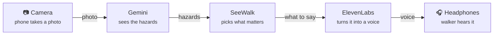

# SeeWalk

**A white cane finds the ground. SeeWalk finds everything else.** People, bikes, cars, potholes and branches at head height are announced calmly, and only when it matters.

SeeWalk runs on a phone worn on a lanyard or chest strap. It watches the path ahead with the rear camera, uses **Gemini** to understand the scene, and speaks short alerts in an **ElevenLabs** voice (English or French) through open-ear Bluetooth headphones.

> Built by team **Goobers** for Hack the Hill III (uOttawa, Sept 25–27, 2026). Original product spec: [`SEEWALK_SPEC.md`](SEEWALK_SPEC.md). Where the two differ, **this README is the current plan**.

---

## At a glance



### 3D model

[](https://raw.githack.com/dkabduli/SeeWalk/main/docs/signal-path-3d.html)

**[🦯 Open the 3D model →](https://raw.githack.com/dkabduli/SeeWalk/main/docs/signal-path-3d.html)**

Drag to turn, scroll to zoom. Source: [`docs/signal-path-3d.html`](docs/signal-path-3d.html).

---

## What we're building for the demo

**Goal: it works and it looks great in a ~2-minute video.** Everything below serves that.

- **In:** live camera → Gemini → short spoken alerts in River's voice, left/right tones, EN/FR, "What's ahead?" button, on-screen captions, fails out loud.
- **Stretch (only if the core is solid):** on-device COCO-SSD fast layer, "Ask" voice questions, Tiger Data hazard map, Vultr deploy.
- **Out:** crowds, night/rain, turn-by-turn navigation, face recognition (never).

---

## How it works: the data flow

**In plain English:** the phone shows a **live camera feed** (like the camera app), but nobody presses a shutter. Every ~1.5 s the app quietly grabs **one still snapshot** from that live feed and sends it to our server. The server asks **Gemini** "what matters in this picture?" and gets back a short structured answer (e.g. *pothole, ahead, 0.9 confidence, "Pothole ahead"*). The phone decides whether it's worth saying, then the server has **ElevenLabs** turn the phrase into River's voice, and the phone plays it in the walker's ears. Then it grabs the next snapshot. So it's **a stream of snapshots, one at a time**, not a video stream and not photos saved to the camera roll.

```
 PHONE (iPhone Safari, worn on chest)                     SERVER (FastAPI)
┌───────────────────────────────────────┐              ┌───────────────────────────────────────┐
│ 1. CAPTURE                            │              │                                       │
│    rear camera → canvas → 768px JPEG  │  2. POST     │ 3. GEMINI 3.5 Flash-Lite              │
│    every ~1.5 s, one request at a time├──/analyze───►│    thinking_level = "minimal"         │
│                                       │ {image,lang} │    structured JSON (SceneResult)      │
│                                       │              │                                       │
│ 5. DECIDE (alert filter)              │◄────JSON─────┤ 4. SceneResult {hazards[], unclear}   │
│    confidence ≥ 0.6                   │              │                                       │
│    same thing not repeated within 5 s │              │                                       │
│    most urgent hazard wins            │              │                                       │
│                 │                     │              │                                       │
│ 6. SPEAK                              │   POST /tts  │ 7. ELEVENLABS Flash v2.5 (River)      │
│    tone panned L / C / R, then ───────┼─{text,lang}─►│    streaming, cached by (text, lang)  │
│    play the phrase ◄──────────────────┼──audio/mpeg──┤                                       │
│    (bundled clip if the network fails)│              │                                       │
│                 │                     │              └───────────────────────────────────────┘
│ 8. Bluetooth → open-ear headphones    │
└───────────────────────────────────────┘
```

1. **Capture.** The phone's rear camera streams into a hidden `<video>`. Every ~1.5 s a frame is drawn to a canvas, resized to 768 px, JPEG q0.7, base64. Only **one request is in flight** at a time (5 s timeout).
2. **Send.** `POST /analyze` with `{ image, lang }`. API keys never leave the server.
3. **See (Gemini).** The server calls **Gemini 3.5 Flash-Lite** through the **Interactions API** with `thinking_level: "minimal"` and a JSON schema, so Gemini returns structured hazards instead of free text. Each frame is judged on its own.
4. **Return.** The validated `SceneResult` goes back to the phone.
5. **Decide.** The phone keeps it simple: drop anything under 0.6 confidence ("never guess"), don't repeat the same hazard + direction within 5 s, and speak only the most urgent one.
6. **Speak.** A short tone panned left/center/right plays first, then the phone sends the hazard's `phrase` to `POST /tts`.
7. **Voice (ElevenLabs).** The server calls **ElevenLabs Flash v2.5** in River's voice and returns the mp3 (cached, so repeated phrases are instant). If the network is down, the phone plays the matching **bundled clip** from `web/public/audio/` instead.
8. **Hear.** Bluetooth to open-ear headphones, so the walker still hears traffic.

### Measured latency (Sept 26, laptop on home Wi-Fi, free tier)

| Step | Time |
|---|---|
| Gemini 3.5 Flash-Lite, minimal thinking (one frame) | **1.16–1.31 s** |
| ElevenLabs Flash v2.5, first audio byte | **0.18–0.27 s** |
| Bluetooth | ~0.2 s |
| **Camera → walker hears it** | **≈ 1.5–1.8 s** |

Alternatives we measured and rejected:

| Option | Result | Why not |
|---|---|---|
| Gemini 3.8 Flash | 3.9–37.7 s per frame | Far too slow (lowest thinking level is "low") |
| Gemini 3.8 Live, speaking for itself | ~1.1 s to first audio | Replaces ElevenLabs/River; answers ran ~4 s long; harder to control what it says |
| Gemini 3.8 Live → transcript → ElevenLabs | ~1.3–1.5 s | Same speed as Flash-Lite, but needs a WebSocket relay; Live can't return text directly |

### Gemini call (`server/gemini.py`)

```python
interaction = client.interactions.create(
    model="gemini-3.5-flash-lite",
    input=[
        {"type": "text", "text": SYSTEM_PROMPT},
        {"type": "image", "data": image_b64, "mime_type": "image/jpeg"},
    ],
    generation_config={"thinking_level": "minimal"},
    response_format={
        "type": "text",
        "mime_type": "application/json",
        "schema": SceneResult.model_json_schema(),
    },
)
result = SceneResult.model_validate_json(interaction.output_text)
```

### System prompt (starting point, tune with real photos)

> You assist a blind pedestrian walking on a quiet street. The camera is chest-height, facing forward. Report ONLY things that matter for walking safely in the next ~10 metres: people or bikes coming toward the walker, cars in or entering the path, drop-offs, stairs, curbs, potholes, uneven pavement, obstacles in the path, head-height obstacles (branches, signs, mirrors), crosswalks, stop signs, construction. Ignore anything off the path, buildings, sky. Never guess: if it isn't clearly visible, leave it out. If the image is too blurry or dark, set unclear=true. Never say anything is safe to cross. Write each `phrase` in {English|French}, at most 4 words, hazard then direction (e.g. "Person ahead, left").

---

## Data contracts

### `SceneResult` (Gemini → server → phone)

```jsonc
{
  "hazards": [
    {
      "type": "person | bike | car | crosswalk | stop_sign | pothole | uneven_surface | head_height_obstacle | obstacle_in_path | construction | curb_or_dropoff | stairs_down | other",
      "direction": "left | ahead | right",
      "distance": "close | near | far",
      "urgency": 1,               // 1 = urgent, 2 = warning, 3 = info
      "confidence": 0.82,         // 0–1
      "phrase": "Pothole ahead"   // ≤ 4 words, in the requested language, spoken by ElevenLabs
    }
  ],
  "unclear": false                // image too blurry/dark to judge
}
```

### Endpoints

| Method | Path | Request | Response |
|---|---|---|---|
| `POST` | `/analyze` | `{ "image": "<base64 jpeg>", "lang": "en" \| "fr" }` | `SceneResult`; `503` if Gemini is unavailable |
| `POST` | `/tts` | `{ "text": "Pothole ahead", "lang": "en" \| "fr" }` | `audio/mpeg` |
| `GET` | `/health` | | `{ "ok": true }` |

### Offline fallback clips

If `/tts` fails, the phone plays a bundled clip chosen by `type` (+ `direction` for person/bike/car). Keys and EN/FR text are in [`web/src/audio/clips.json`](web/src/audio/clips.json); the mp3s are in `web/public/audio/{en,fr}/`. System clips: `walk_started`, `walk_stopped`, `no_connection`, `connection_back`, `camera_blocked`, `unclear`.

### Fail out loud

Silence must never mean "all clear" by accident.

| Condition | What the walker hears |
|---|---|
| 2 failed `/analyze` calls in a row | low tone + "No connection, I can't see right now" (repeats every 20 s; "Connection back" on recovery) |
| Camera stops or lens covered | low tone + "Camera blocked" |
| `unclear: true` while walking | nothing |
| `unclear: true` after tapping **"What's ahead?"** | "Unclear" |

---

## Tools breakdown

| Tool | What we use it for | Where in the code | Status |
|---|---|---|---|
| **Gemini 3.5 Flash-Lite** (Interactions API, `google-genai` SDK) | Looks at each frame and returns hazards as JSON | `server/gemini.py` | ✅ key works, 1.2 s measured |
| **ElevenLabs Flash v2.5** | Speaks each alert live in River's voice (EN/FR) | `server/tts.py` | ✅ key works, 0.2 s measured |
| **ElevenLabs Multilingual v2** | Pre-made offline/system clips | `server/scripts/generate_clips.py` → `web/public/audio/` | ✅ 48 clips generated |
| **FastAPI** (Python 3.12) | Backend: holds the keys, `/analyze`, `/tts`, `/health` | `server/main.py` | ⬜ next |
| **React + Vite + TypeScript** | The phone web app | `web/` | ⬜ scaffold Saturday AM |
| **getUserMedia + Canvas** | Camera feed and frame capture on the iPhone | `web/src/camera/` | ⬜ |
| **Web Audio API** | Panned tones + playing speech | `web/src/audio/` | ⬜ |
| **cloudflared / ngrok** | HTTPS tunnel so the iPhone can use the camera during dev | — | ⬜ |
| **Vultr + Caddy** | Hosting with automatic HTTPS | — | stretch |
| **GoDaddy Registry domain** | Public URL for the demo | — | stretch |
| **TensorFlow.js + COCO-SSD** | On-device fast layer for people/bikes/cars (~0.2 s) | `web/src/detection/` | stretch |
| **Tiger Data** + **Leaflet** | Hazard map (civic layer) | `server/db.py`, `web/src/pages/Map.tsx` | stretch |
| **GitHub** | Repo, one branch per person, PRs into `main` | — | ✅ |

---

## Who's doing what

Each person owns their own folders so we don't step on each other. Everyone builds against the **data contracts** above: if your piece sends/receives exactly those shapes, the pieces fit together.

```
 Abdul (camera)          Aroha (backend)                 Jibril (UI + audio)          Siddig (tunnel + video)
 snapshot every 1.5 s ─► /analyze → Gemini → JSON ─────► filter → tone → /tts ─────► headphones ─► 🎥 filmed
                                   /tts → ElevenLabs ◄──┘
```

**Order of work Saturday morning:** Jibril pushes the `web/` scaffold first (≈30 min). Aroha starts the backend immediately (no dependency). Abdul starts camera code as soon as the scaffold lands. Siddig sets up the tunnel so everyone can test on iPhones.

---

### Aroha: AI + backend (`server/`)

**Your job:** take a snapshot in, give hazards out (`/analyze`); take a phrase in, give River's voice out (`/tts`).

**Tasks**
- [ ] **`server/schemas.py`**: Pydantic models exactly matching the [data contracts](#data-contracts): `Hazard`, `SceneResult`, `AnalyzeRequest {image, lang}`, `TTSRequest {text, lang}`. Use `Literal[...]` for `type`, `direction`, `distance`, `lang`.
- [ ] **`server/gemini.py`**: `async def analyze_frame(image_b64: str, lang: str) -> SceneResult`
  - `genai.Client(api_key=config.GEMINI_API_KEY)`, call `client.aio.interactions.create(...)` (async version of the snippet above) with `model=config.GEMINI_MODEL`, `generation_config={"thinking_level": config.GEMINI_THINKING_LEVEL}`, `response_format` = `SceneResult` JSON schema
  - Put the system prompt above in, with `{English|French}` filled from `lang`
  - Validate with `SceneResult.model_validate_json(...)`; 4 s timeout
- [ ] **`server/scripts/eval_samples.py`**: loop over `samples/*.jpg`, call `analyze_frame`, print each photo's hazards + phrases + time, then median and worst time. Save to `samples/results.json`.
- [ ] **Prompt tuning**: run the eval, look for hazards it missed or invented, adjust the prompt, repeat. Phrases must be ≤ 4 words and in the right language.
- [ ] **`server/tts.py`**: `async def synthesize(text: str, lang: str) -> bytes`
  - `httpx.AsyncClient` → `POST https://api.elevenlabs.io/v1/text-to-speech/{ELEVENLABS_VOICE_ID}/stream?output_format=mp3_44100_64`
  - header `xi-api-key`, JSON `{"text", "model_id": config.ELEVENLABS_TTS_MODEL, "language_code": lang}`
  - In-memory cache keyed by `(text, lang)` (a dict capped at ~200 entries is fine)
- [ ] **`server/main.py`**: FastAPI app
  - CORS from `config.ALLOWED_ORIGINS`
  - `POST /analyze` → `SceneResult`; on Gemini error/timeout/429 return `503`
  - `POST /tts` → `Response(content=mp3, media_type="audio/mpeg")`
  - `GET /health` → `{"ok": true}`
  - Log the time each request took (never log the image)
- [ ] Run it: `cd server && .venv/bin/uvicorn main:app --reload --host 0.0.0.0 --port 8000`

**You're done when**
- `curl localhost:8000/health` → `{"ok":true}`
- `curl -X POST localhost:8000/tts -H 'content-type: application/json' -d '{"text":"Pothole ahead","lang":"en"}' -o out.mp3` plays River
- The eval on the team's photos: median ≤ 1.5 s, no invented hazards, stop signs/crosswalks/curbs found

**Tips**
- Test `/analyze` with a photo: `base64 -i samples/stop.jpg` pasted into a JSON body, or add a tiny `scripts/try_analyze.py`.
- Free tier returns `429` if we call too often. Return `503` so the phone treats it as "try again".
- Existing helpers: `config.py` loads every key, `scripts/check_connections.py` shows the SDK and ElevenLabs calls working.

---

### Abdul: camera + capture (`web/src/camera/`, `web/src/api/`) + repo owner

**Your job:** turn the iPhone's live camera into a steady stream of snapshots sent to `/analyze`, and report when things break.

**Tasks**
- [ ] **`web/src/api/types.ts`**: TypeScript types copied from the [data contracts](#data-contracts) (`Hazard`, `SceneResult`). Everyone imports from here.
- [ ] **`web/src/api/client.ts`**: `analyze(imageB64, lang, signal): Promise<SceneResult>` and `tts(text, lang): Promise<ArrayBuffer>`, both calling `/api/...` (Vite proxies to the server).
- [ ] **`web/src/camera/useCamera.ts`**: `getUserMedia({ video: { facingMode: { ideal: "environment" } }, audio: false })` into a `<video playsInline muted autoPlay>`; stop all tracks on Stop; `track.onended` → report `camera_blocked`.
- [ ] **`web/src/camera/captureFrame.ts`**: draw the current video frame to a canvas, long edge 768 px, `toDataURL("image/jpeg", 0.7)`, strip the `data:...base64,` prefix. Also compute average brightness from a tiny 32×32 copy; very dark → `camera_blocked` (lens covered).
- [ ] **`web/src/camera/useWalkLoop.ts`**: the snapshot loop
  - `useWalkLoop({ lang, onResult, onSystem })` → `{ videoRef, start, stop }`
  - Loop: capture → `await analyze(...)` with a 5 s `AbortController` → `onResult(result)` → wait until `VITE_FRAME_INTERVAL_MS` has passed since this round started → repeat
  - Only **one request in flight**; never overlap
  - 2 failures in a row → `onSystem("no_connection")` (again every 20 s while down); first success after that → `onSystem("connection_back")`
  - Keep the screen awake with `navigator.wakeLock.request("screen")` (ignore if refused)
- [ ] `VITE_FRAME_INTERVAL_MS` in `web/.env.local`: `5000` during dev (free tier), `1500` for filming
- [ ] Repo owner: send teammates the ElevenLabs key privately, turn on Gemini billing on the demo key before filming, review and merge PRs into `main`

**You're done when**
- On an iPhone (through Siddig's tunnel) the rear camera shows live, and the console logs a `SceneResult` every interval
- Airplane mode → `no_connection` fires after 2 failures; back online → `connection_back`
- Covering the lens → `camera_blocked`

**Stretch:** COCO-SSD fast layer for people/bikes/cars (`web/src/detection/`), or an "Ask" button for spoken questions.

---

### Jibril: phone UI + audio (`web/` scaffold, `web/src/pages/`, `audio/`, `alerts/`, `i18n/`)

**Your job:** the screen the walker taps, and everything they hear.

**Tasks**
- [ ] **Scaffold first (push within ~30 min Saturday morning):**
  ```bash
  npm create vite@latest web -- --template react-ts
  cd web && npm install
  ```
  In `vite.config.ts`: `server: { host: true, allowedHosts: true, proxy: { "/api": { target: "http://localhost:8000", rewrite: p => p.replace(/^\/api/, "") } } }`. Create the empty folders from the repo layout. **Don't delete `web/public/audio/` or `web/src/audio/clips.json`** (already committed).
- [ ] **`web/src/pages/WalkMode.tsx`**
  - Huge Start/Stop button (full width, ≥ 120 px tall), EN/FR toggle, **"What's ahead?"** button
  - Big caption line showing the last thing spoken (`aria-live="polite"`); this is what viewers read in the video
  - Small status line: Walking / No connection / Camera blocked
  - High contrast, readable in sunlight, nothing that requires looking at the screen
- [ ] **`web/src/audio/AudioEngine.ts`**
  - Create + `resume()` an `AudioContext` **inside the Start tap** (iOS blocks audio otherwise)
  - `playTone(pan)`: short beep 880–1200 Hz through a `StereoPannerNode` (left −1, ahead 0, right +1)
  - `playSpeech(mp3: ArrayBuffer, pan)`: `decodeAudioData` then play
  - `playClip(key, lang)`: preload the bundled clips from `/audio/{lang}/{key}.mp3` on Start
  - One sound at a time; urgency 1 interrupts whatever is playing
- [ ] **`web/src/alerts/pickAlert.ts`**: `pickAlert(result, now): Hazard | null`: drop `confidence < 0.6`; drop the same `type + direction` spoken in the last 5 s; pick the lowest `urgency` (then `close` before `near` before `far`).
- [ ] **Speak flow** (wire it in `WalkMode`): `onResult` → `pickAlert` → tone → `tts(phrase)` → `playSpeech` → update caption. If `tts` fails → play the matching bundled clip instead (map `type` → clip key; person/bike/car use `_left/_ahead/_right`).
- [ ] System sounds from `onSystem`: `walk_started`, `walk_stopped`, `no_connection`, `connection_back`, `camera_blocked` (bundled clips + a low tone).
- [ ] **"What's ahead?"**: runs one capture immediately; if `unclear` → play `unclear`; if nothing → say nothing new (or "Unclear" if unclear).
- [ ] **`web/src/i18n/strings.ts`**: EN/FR button labels.
- [ ] VoiceOver pass: every button has a clear label, Start is reachable first.

**You're done when**
- Tap Start → hear "Walk mode on"
- A fake `SceneResult` (hard-code one while the backend isn't ready) → tone in the right ear + "Car on your right" in River's voice + caption appears
- Switching to FR plays French

**Tip:** you can build everything with bundled clips and fake results before Aroha's `/tts` is up.

---

### Siddig: tunnel + deploy + video + Devpost

**Your job:** get the app onto everyone's iPhone over HTTPS, then turn the working app into a great 2-minute video and Devpost.

**Tasks**
- [ ] **HTTPS tunnel (Saturday morning):** the iPhone camera only works over HTTPS.
  ```bash
  brew install cloudflared
  cloudflared tunnel --url http://localhost:5173
  ```
  Share the `https://….trycloudflare.com` URL in the group chat. Confirm an iPhone can open it and allow the camera.
- [ ] **`docs/shot-list.md`**: every scene, what SeeWalk should say, the on-screen caption, who's in frame:
  1. Hook: phone on chest strap, open-ear headphones, "A white cane finds the ground…"
  2. Person walking toward the camera → "Person ahead"
  3. Stop sign → "Stop sign ahead"
  4. Crosswalk → "Crosswalk ahead"
  5. Curb / pothole / uneven pavement
  6. Chair or bin in the path → "Obstacle in your path"
  7. French switch → same scene in French
  8. Honesty moment: blurry/covered view → "Unclear"
  9. Fail out loud: airplane mode → "No connection"
- [ ] **Gear:** lanyard or chest strap for the demo phone, open-ear or single earbud, a second phone to film, the demo phone's **screen recording on with sound** (captures what SeeWalk said).
- [ ] **Film in daylight: sunset in Ottawa is ~7 PM Saturday.** Aim for Saturday 4:30–6:45 PM; backup Sunday 7–8 AM. Several takes of each scene.
- [ ] **Edit** (~2 min): hook (15 s) → field walk with captions (60 s) → "Unclear" + no-connection moments (20 s) → how it works: 3D model + "Gemini sees, ElevenLabs speaks" (15 s) → vision: bilingual, wearable next (10 s).
- [ ] **Devpost**: inspiration, what it does, how we built it (tools breakdown above), challenges (the latency tests), what's next. Tag Gemini, ElevenLabs, GoDaddy/Vultr if used, Best UI/UX. Add all four teammates, link this repo. **Submit by 9:30 AM Sunday.**

**You're done when:** the video is uploaded, Devpost is submitted with all 4 names, and the repo link works.

**Stretch:** Vultr + GoDaddy domain with Caddy HTTPS so the demo URL doesn't depend on a laptop; Tiger Data hazard map.

---

### Everyone
- [ ] Get the keys from Abdul (privately), run `server/scripts/check_connections.py` → ✅✅
- [ ] 3–4 chest-height photos each (curbs, crosswalks, stop signs, stairs, potholes, branches) → send to Aroha for `samples/`
- [ ] `git pull origin main` before starting; work on your branch (`Abduls-Work`, `Arohas-Work`, `Siddigs-Work`, `Jibrls-Work`); open a PR into `main` when something works; commit often (judges read the history)

## Phases

| Phase | When | Goal | Done when |
|---|---|---|---|
| **0. Setup** | Fri night | Keys, voice, clips, repo | ✅ Gemini + ElevenLabs connected, River picked, 48 clips, branches made |
| **1. Foundations** | Sat 9 AM – 12 PM | Backend works; `web/` scaffolded; camera on iPhone; tunnel up | `curl /analyze` returns hazards for a street photo; iPhone shows the live camera over HTTPS |
| **2. End to end** | Sat 12 – 3 PM | Phone → Gemini → ElevenLabs → ears | Point the iPhone at a stop sign and hear **"Stop sign ahead"** in River's voice |
| **3. Demo-ready** | Sat 3 – 4:30 PM | Tones, captions, EN/FR, "What's ahead?", fail out loud, prompt tuned | A full walk around one block sounds calm and correct |
| **4. Film** | Sat 4:30 – 6:45 PM (sunset ~7 PM) | Billing on, record the field walk (several takes) | Clean footage of every scene on the shot list |
| **5. Polish + stretch** | Sat 7 PM – Sun 1 AM | Edit video, stretch goals only if the core is solid. **1 AM feature freeze**. Backup reshoot Sun 7–8 AM | No known demo bugs; rough cut of the video |
| **6. Submit** | Sun 7 – 9:30 AM | Final video cut, Devpost, add teammates, link GitHub | **Submitted by 9:30 AM** |

---

## Setup (server)

Needs **Python 3.10+** (older SDK versions that support 3.9 don't have the Interactions API).

```bash
cd server
python3 -m venv .venv
.venv/bin/pip install -r requirements.txt
cp .env.example .env          # then fill in the keys (see below)
.venv/bin/python scripts/check_connections.py
```

**Keys (free tier for now):**
- **Gemini:** create **your own** free key at [aistudio.google.com/api-keys](https://aistudio.google.com/api-keys) so each of us has a separate rate limit. Billing gets enabled on one demo key before filming.
- **ElevenLabs:** use the shared team key (ask Abdul; send it privately, never commit it).
- Set `VITE_FRAME_INTERVAL_MS` to **5000–6000** during development to stay under free-tier limits.

`server/.env` is git-ignored. Variables:

| Variable | Value |
|---|---|
| `GEMINI_API_KEY` | from Google AI Studio |
| `GEMINI_MODEL` | `gemini-3.5-flash-lite` |
| `GEMINI_THINKING_LEVEL` | `minimal` |
| `ELEVENLABS_API_KEY` | from ElevenLabs → Developers → API keys |
| `ELEVENLABS_VOICE_ID` | `SAz9YHcvj6GT2YYXdXww` (River: one voice for EN + FR) |
| `ELEVENLABS_TTS_MODEL` | `eleven_flash_v2_5` |
| `DATABASE_URL` | Tiger Data connection string (stretch) |
| `ALLOWED_ORIGINS` | e.g. `http://localhost:5173` |

## Repo layout

```
seewalk/
├── server/                      # FastAPI
│   ├── main.py                  # /analyze, /tts, /health
│   ├── gemini.py                # Gemini Flash-Lite call + prompt
│   ├── tts.py                   # ElevenLabs Flash + cache
│   ├── schemas.py               # SceneResult, Hazard, request models
│   ├── config.py                # env vars
│   └── scripts/
│       ├── check_connections.py # ping Gemini, ElevenLabs, Tiger Data
│       ├── phrases.py           # EN/FR fallback phrase table
│       ├── generate_clips.py    # build web/public/audio/{en,fr}
│       └── eval_samples.py      # run samples/*.jpg through Gemini
├── web/                         # React + Vite + TS
│   ├── public/audio/{en,fr}/    # bundled ElevenLabs clips (offline fallback)
│   └── src/
│       ├── camera/              # camera + frame capture (Abdul)
│       ├── api/                 # analyze(), tts()
│       ├── alerts/              # filter: confidence, no-repeat, urgency (Jibril)
│       ├── audio/               # tones, speech playback, clips.json (Jibril)
│       ├── i18n/                # EN/FR strings
│       └── pages/WalkMode.tsx   # main screen (Jibril)
├── samples/                     # street photos for testing
├── docs/                        # 3D model + images
└── SEEWALK_SPEC.md              # original spec
```

## Design principles

1. **Speak less.** Four words max; tones for direction.
2. **Hazards first.** Danger → direction → description.
3. **Never guess.** Low confidence means silence, or "Unclear" when asked.
4. **Inform, never command.** Never say "safe to cross" or "go."
5. **No screen needed.** Large labelled buttons; works with VoiceOver.
6. **Fail out loud.**
7. **Privacy.** Frames are processed and discarded; people are never identified.
